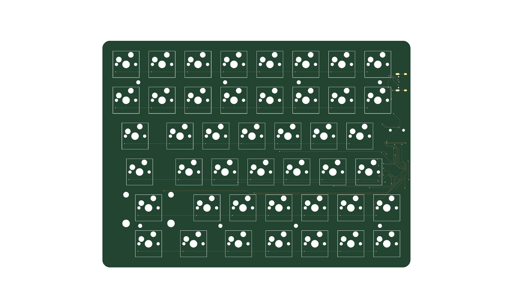
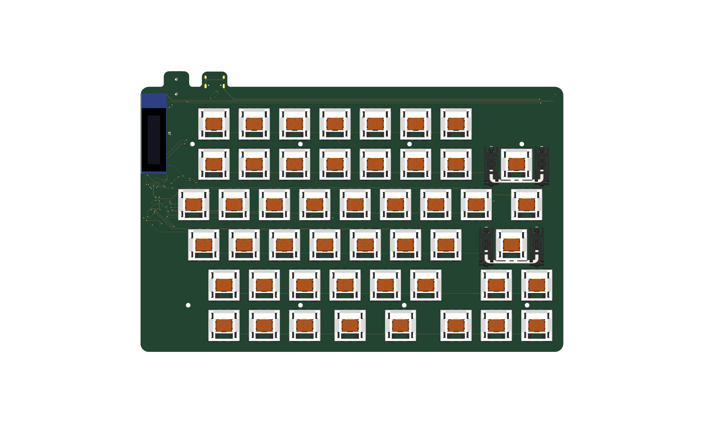
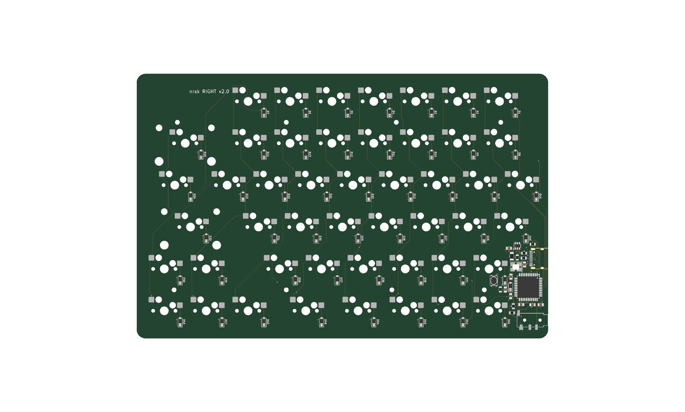
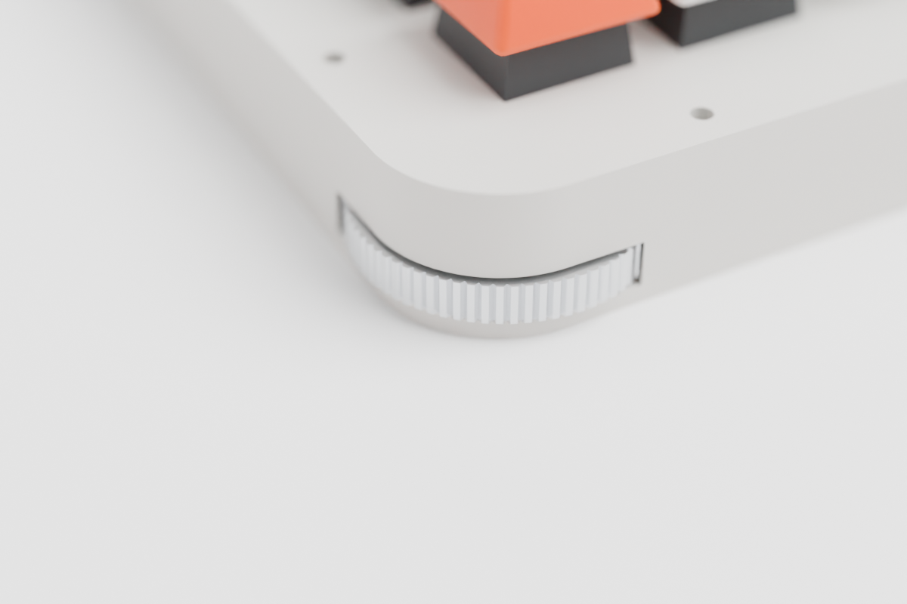
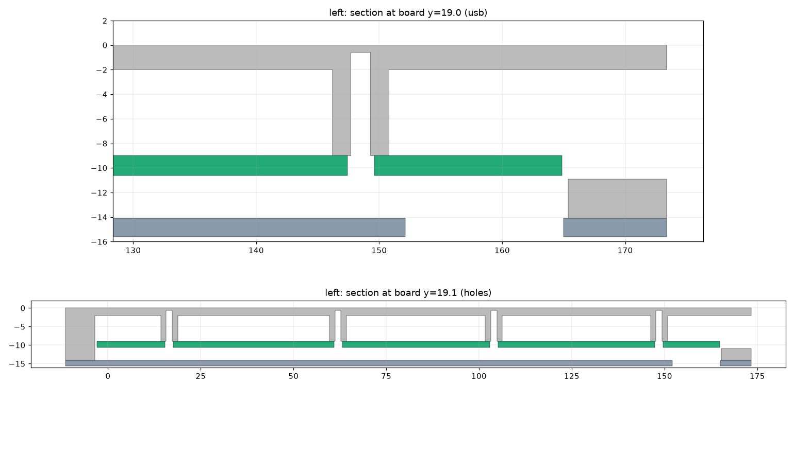
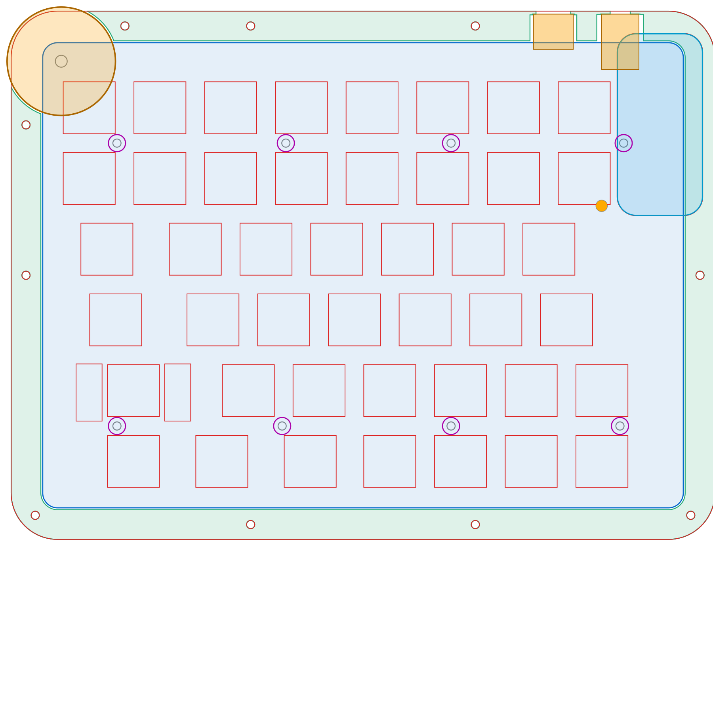
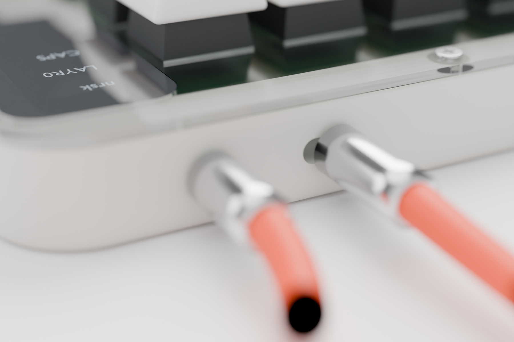
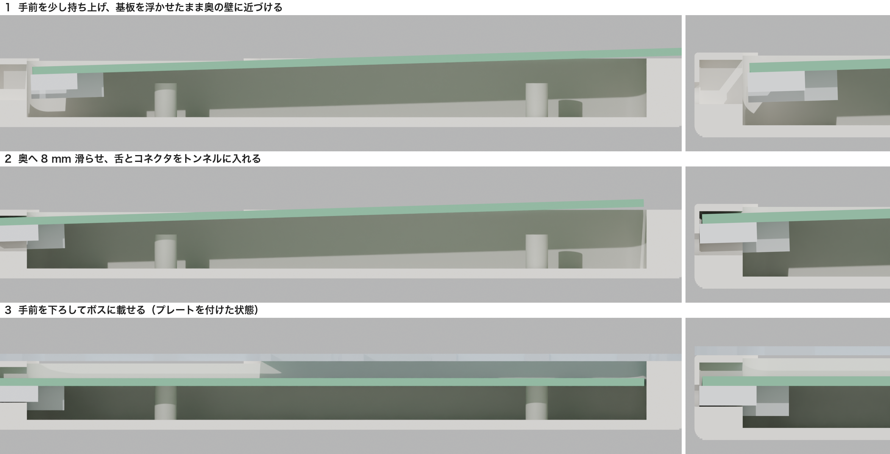

# nrsk 分割キーボード v2（基板と筐体）

KLE レイアウト（`kle/left.json`、`kle/right.json`）から生成した、左右分割・有線接続のキーボード基板です。
KiCad 10 のプロジェクト（回路図と配線済み基板）、製造用ガーバー、BOM、QMK ファームウェア設定を含みます。筐体のデータ（アクリルのレーザーカット用 DXF/SVG と 3D プリント用 STL）も入っています。

v2 では Pro Micro などのマイコンボードをやめ、RP2040 と QSPI Flash、USB-C コネクタなどを基板に直接実装しました。
マイコンボード用に設けていた内側の帯（約 20 mm）がなくなり、基板はキー領域とほぼ同じ大きさになっています。

| 項目 | 内容 |
| --- | --- |
| キー数 | 左 44 + 右 48 = 92 |
| マイコン | RP2040（QFN-56、12 MHz 水晶、I/O 3.3 V）と 16 MB の QSPI Flash W25Q128JV を左右に 1 組ずつ、裏面に直接実装 |
| USB | USB-C（USB 2.0）を左右それぞれに搭載 |
| 左右接続 | TRRS 3.5 mm（4 極ケーブル）、QMK の PIO シリアル（半二重、1 本の信号線）と 5 V 給電 |
| スイッチ | Cherry MX 互換、Kailh MX ホットスワップソケット（裏面） |
| 基板 | 2 層、左 172.6 × 126.3 mm、右 199.6 × 126.3 mm（キー配列の外周から 3 mm を基本に、上端を 6 mm、内側を左 9.4 mm・右 12.6 mm 広げて OLED・USB-C・TRRS・マイコンの場所を確保）、四隅は半径 4 mm の角丸、M2 取付穴 × 8（片側あたり） |
| 筐体 | 左 189.6 × 143.3 mm、右 216.6 × 143.3 mm、高さ 15.6 mm（3D プリント版）／ 16.5 mm（アクリル版）、いずれもプレート上面まで |
| 外観 | プレートは透明アクリル 1.5 mm、アクリル版の枠と底板はマットクリア 3 mm。プレートは外周の切り欠きなし。USB-C と TRRS の穴はコネクタの外形ぴったり（基板の舌で差込口を外面の 0.8 mm 内側まで出している）。3D プリントのトレイは外周の角をフィレット加工（B のプレートも上面の外周に半径 1 mm の R） |
| 表示 | 0.91 インチ OLED（128×32）を左右に 1 枚ずつ、プレートと面一のハーフミラーアクリルのカバー付き。高さは増えない |
| ホイール | 左上と右上の角にサムホイール（ロータリーエンコーダー Alps EC05E1220401 で読み取り、1 回転 12 クリック）。高さは増えない |
| 3D ビューア | http://www.0x0c.me/spltnrskb/ 、組み立てガイドは http://www.0x0c.me/spltnrskb/assembly.html （GitHub Pages、`main` への Push で自動更新） |





完成イメージ（Blender でレンダリング）です。筐体は 2 つの 3D プリント版を採用しています。左が A（3D プリントのトレイ + 透明アクリルのプレート）、右が B（プレートも 3D プリント）です。A はプレートを上からスリムヘッドの小ねじで、B は底からネジで留めます（B の上面にはネジが見えません）。


## 回路

各半分に同じ回路が載っています。Raspberry Pi の RP2040 設計ガイド（Hardware design with RP2040）の最小構成に、保護部品を加えた構成です。

| 機能 | 部品 |
| --- | --- |
| QSPI Flash | W25Q128JVS（16 MB、SOIC-8 208 mil）、0.1 µF |
| クロック | 12 MHz 水晶（3225）、15 pF × 2、XOUT に 1 kΩ 直列 |
| 電源 | VCC（5 V）→ LDO AP2112K-3.3（入出力 1 µF）→ 3V3。コアの 1.1 V は RP2040 内蔵レギュレータ（VREG_VIN／VREG_VOUT に 1 µF） |
| 電源のパスコン | IOVDD × 6、DVDD × 2、USB_VDD、ADC_AVDD にそれぞれ 0.1 µF、3V3 に 10 µF |
| USB | 27 Ω × 2（D+/D−）、CC 用 5.1 kΩ × 2（USB-C のデバイス認識用）、ESD 保護 USBLC6-2SC6 |
| 電源経路 | VBUS → ポリスイッチ 500 mA → ショットキーダイオード B5819W → VCC（5 V、TRRS で反対側にも給電） |
| リセットと書き込み | RUN を 10 kΩ でプルアップしたリセットスイッチ（裏面）。BOOTSEL は QSPI_SS から 1 kΩ を通したはんだジャンパー |
| 左右判定 | GP0 を 10 kΩ で左は 3V3、右は GND に接続 |

- ショットキーダイオードは逆流を防ぎます。TRRS で給電されている側の USB-C の VBUS には電圧が出ないので、両方の USB を挿してもホスト側に電流が逆流しません。USB を挿していない側が自分をマスタだと誤判定することもありません。
- RP2040 はブートローダーを ROM に持っています。Flash が空のときは USB を挿すだけで `RPI-RP2` ドライブとして見え、UF2 ファイルをコピーすれば書き込めます。一度 QMK を書き込んだあとは、リセットスイッチを素早く 2 回押すと同じ書き込みモードに入ります。ISP 書き込み器は必要ありません。
- OLED は 3.3 V で動かします。サムホイールのエンコーダーは、A 相と B 相を RP2040 の内蔵プルアップで読み、共通端子を GND につないでいます。

### マルチプレクサは不要

片側のマトリックスは 6 行 × 8 列で、使う GPIO は 14 本です。
RP2040 の GPIO は 30 本あるので、シリアル通信 1 本、左右判定 1 本、I2C 2 本、エンコーダー 2 本を足しても十分に足ります。
右側の `\` キーは、配線上は行 0 の列 7 に割り当てて、左右とも 6 × 8 のマトリックスにそろえています（QMK の分割キーボードは左右で同じ列数を前提とするため）。

### ピン割り当て（左右共通）

| 用途 | GPIO |
| --- | --- |
| ROW0〜ROW5 | GP4〜GP9 |
| COL0〜COL7 | GP10〜GP14、GP16〜GP18（GP15 は QFN の角で配線しにくいため使わない） |
| I2C1（OLED） | SDA = GP2、SCL = GP3 |
| サムホイールのエンコーダー | A 相 = GP19、B 相 = GP20（共通端子は GND） |
| 左右間データ | GP1、TRRS の Tip |
| 左右判定 | GP0 |
| 予備 | GP15、GP21〜GP29 |

TRRS の配線は Tip = DATA、Ring2 = VCC（5 V）、Sleeve = GND で、Ring1 は未接続です。

## 配置

- 表面: スイッチだけです。スイッチプレートより上に出る部品はありません。
- 裏面: ホットスワップソケット、ダイオード、RP2040、Flash、LDO などの周辺部品、リセットスイッチ、BOOTSEL パッド、USB-C、TRRS。
- USB-C と TRRS はどちらも奥の辺（上端）に置き、ケーブルを後ろへ出します。TRRS は内側の角寄り（OLED の上）、USB-C はその 18 mm 外側です。どちらも基板の外形を幅 12 mm の舌として壁の中まで伸ばし、舌の先端へコネクタを載せています。差込口はケースの外面から 0.8 mm 内側です。舌の先端の角は半径 2.5 mm、付け根は半径 1.5 mm の R を付けてあり、基板単体で持っても角が手に刺さりません。マイコンはコネクタの下の裏面にあります。
- 基板と筐体は、左右それぞれのキー配列にぴったり合わせた大きさです（左は OLED の分だけ内側を広げています）。マイコンは裏面に置いています。
- 2 u 以上のキー（左 Shift 2.25 u、右 Backspace 2 u、右 Enter 2.25 u）には PCB マウント型スタビライザの穴があります。
- 配線ルールは信号線 0.2 mm、電源線 0.4 mm、クリアランス 0.2 mm、ビア 0.6/0.3 mm です。最小配線幅は 0.15 mm で、USB-C の細いピンに入る部分だけで使っています。JLCPCB などの標準仕様（最小 0.127 mm）で製造できます。
- マイコン周りの部品番号はシルクに収まらないため、Fab 層に入れています。半田付けには `fab/<side>/nrsk-<side>-assembly-back.pdf`（裏面の実装図、左右反転済み）を使ってください。配線の確認には `fab/<side>/nrsk-<side>-copper.pdf` を使えます（1 ページ目が表面 F.Cu、2 ページ目が裏面 B.Cu で、どちらも外形付き）。

## サムホイール（角のダイヤル）

左半分の左上、右半分の右上の角に、親指でなぞって回すサムホイールを付けています。



- 形: 直径 29.2 mm、厚さ 4.1 mm のホイールで、外周に 32 山の丸い歯（深さ 0.5 mm）があります。歯は指のすべり止めです。角の丸みと同心に置いていて、縁が角から約 3.5 mm、両側面から約 1 mm 出ます。
- 位置: 基板と底のすき間（7 mm）に水平に寝かせています。壁の下側だけを切り欠くので、プレートと壁の上部は切れ目がありません。キーボードの高さも変わりません。
- 検出: 基板裏面のホイールの中心の真上に、中空シャフトのロータリーエンコーダー Alps EC05E1220401 を下向きに付けています。ホイール上面の六角ピン（対辺 1.66 mm）が、エンコーダーの六角穴（対辺 1.72 mm）に 2 mm 入って回転部を回します。エンコーダーの下面に当たらないよう、ホイール上面の中心（半径 6 mm）を 0.4 mm 下げています。基板には、回転部の下に 3 mm 角の穴があります。
- クリック: エンコーダーが内蔵するクリックを使い、1 回転 12 クリック（30° ごと）です。1 クリックで A 相と B 相がちょうど 1 周期進むので、クリックとファームウェアの 1 ステップは部品の中で一致しています。
- 軸: 3D プリント版はトレイの床から立てた軸（直径 3.6 mm）、アクリル版は底板の下から通す M3 ネジを軸にします。ホイールの下面には軸穴（直径 4 mm × 深さ 2 mm）があります。親指で押す横向きの力はこの軸で受け、エンコーダーには回転だけを伝えます。軸と軸穴の間に半径方向で 0.2 mm 以上のすき間を設けて、基板とケースの位置ずれでホイールがこじれないようにしています。
- 組み立て: 3D プリント版で基板をトンネルへ滑り込ませるとき、エンコーダーの下面は六角ピンの先端の約 0.3 mm 上を通ります。ホイールのある角を少し持ち上げて滑らせてください。基板を下ろすときは、ホイールの縁を指で少し回すと、ピンがエンコーダーの穴に入ります。
- 左の Esc キー: エンコーダーと Esc のホットスワップソケットが重ならないよう、基板の上端を 1 mm 余分に延ばしてホイールを上へずらしています。そのため、すべてのスイッチを同じ向きで取り付けます。
- ファームウェア: QMK のエンコーダー機能で読みます。エンコーダーは基板の裏で下を向いているので、A 相と B 相のピンを入れ替えて設定し、上から見た時計回りを正の向きとして扱います。USB をつないでいない側のホイールも、QMK が左右間の通信で送ります。

| | 左ホイール | 右ホイール |
| --- | --- | --- |
| 回す（レイヤー 0） | 音量 | ページ上下 |
| 回す（レイヤー 1） | 画面の明るさ | カーソル左右 |

割り当ては `keymap.c` の `encoder_update_user()` で変更できます。

検討段階の記録として、側面ダイヤルの 2 タイプ（サムホイール型と横向きノブ型）を比べたレンダリングは [docs/img/dial-study/dial-grid.jpg](docs/img/dial-study/dial-grid.jpg) にあります。サムホイール型を採用し、角に置きました。

読み取りの方式は、当初の磁気角度センサー AS5600 と磁石、ボールプランジャーの組み合わせから、市販のロータリーエンコーダーに変えました。理由と検討した代替案は [docs/specs/thumbwheel-encoder.md](docs/specs/thumbwheel-encoder.md) に、両者の断面の比較は [docs/img/encoder-study/sheet.jpg](docs/img/encoder-study/sheet.jpg) にあります。

## OLED

左右に 0.91 インチの OLED モジュール（128×32、SSD1306、I2C）を 1 枚ずつ付けています。

- 配線: マイコンの PD0（SCL）と PD1（SDA）に接続し、4.7 kΩ でプルアップしています。モジュールのピン順は GND / VCC / SCL / SDA です。VCC と GND が逆のモジュールもあるので、購入前に確認してください。
- 配置: 左右とも内側の端、1〜2 段目の高さに縦向きで置き、上端からの位置をそろえています。右はキーのない切り欠きに収まり、左は基板の内側を 4.7 mm 広げて、スイッチとの隙間を右と同じ 2.45 mm にしています。
- 取り付け: ピンヘッダの黒い樹脂スペーサーを外し、OLED のガラス上面が基板の上面から 2.5 mm の高さになるように、モジュールを基板に近づけて半田付けします。
- 筐体: OLED を中心にした角丸長方形（窓より 5 mm 大きい）のハーフミラーのアクリル（`case/laser/<side>-oled-cover`）を、プレートの切り欠きにはめ込みます。ハーフミラーのアクリルは 2 mm 厚からしか市販されていません。そこで 3D プリント版は壁の上面をカバーの下だけ 0.5 mm 下げて、上面をプレートと面一にしています（アクリル版は 0.5 mm 高くなります）。カバーは OLED のガラス面と壁の上面に透明両面テープで貼り、ネジは使いません。消灯中は鏡のように見え、点灯すると表示が透けて見えます。カバーの周りに余白を取るため、基板の上端を 5 mm 延ばし（ホイールのためにさらに 1 mm 延ばして計 6 mm）、内側を左右とも約 4.6〜4.7 mm 広げています。
- 表示: QMK の `oled_task_user` で、USB をつないだ側にレイヤーと Caps Lock、もう一方に WPM を表示します。処理は `firmware/qmk/keyboards/nrsk/keymaps/default/keymap.c` にあります。

### OLED の高さ・角度の比較

検討段階の記録です（採用したのは、上に書いたプレートと面一のハーフミラーのカバーです）。画像は当時の基板・筐体の形で描いています。
キーキャップに隠れにくい OLED の付け方を、高さ 0〜13 mm の 4 案（A〜D）と傾斜 2 案（E・F）で比べました。
座った目線と寄りのレンダリングを、取り付け方式ごとに [docs/img/render-grid.jpg](docs/img/render-grid.jpg) にまとめています。
台座の形状は `gen/oled_variants.py`、レンダリングは `gen/render_all.sh` で作り直せます。デフォルトは確認用のプレビュー（長辺 1200 px、数分）で、`FINAL=1 ./gen/render_all.sh` とすると高画質（長辺 2400 px）で出力します。
B〜F は OLED を基板の外側（壁の上）へ移すため、基板のコネクタから配線でつなぐ前提です。

## 筐体

3D プリントとアクリルのレーザーカットのどちらでも作れるよう、同じ寸法のサンドイッチ構造にしています。3D プリントのトレイを使う版は 2 種類あり、どちらも正式な仕様です。

- **A：トレイ + 透明アクリルのプレート** — トレイは 3D プリント、スイッチプレートは透明アクリル 1.5 mm（`case/laser/<side>-plate`）。プレート越しに基板が見えます。
- **B：全部 3D プリント** — プレートも 3D プリント（`case/print/<side>-plate.stl`）。スイッチの爪が掛かる周りだけ 1.5 mm で、ほかは裏に 2 mm の補強があり、上下を逆にして印刷します。中は見えません。
- **アクリル版** — 底板・枠・プレートをすべてアクリルのレーザーカットで積み重ねます。

トレイは A と B で共通です。壁の中を縦にネジ穴が通り、上面には丸いくぼみ、その下に六角のナット受けがあります。A は透明アクリルのプレートを、ナット受けに入れた M2 ナットへスリムヘッド小ねじ M2 × 6 mm（頭 φ4 × 0.5 mm）で上から留めます。B は、プレート裏のボスに入れたヒートセットインサートへ、トレイの底の座ぐりから M2 × 12 mm のなべネジで留めるので、上面にネジは見えません。アクリル版は上から M2 × 20 mm で底板の下のナットまで共締めします。
基板は 8 か所の取り付け穴で筐体の底に固定し、スイッチプレートは外周のネジで留めます。
寸法の基準は MX の規格（プレート上面から基板上面まで 5.0 mm）です。




| 部分 | A / B（3D プリントのトレイ、`case/print/`） | アクリル版（`case/laser/`） |
| --- | --- | --- |
| 底 | トレイの床 2 mm、外周の下端 R2・上端 R0.6 のフィレット | 底板 3 mm（`<side>-bottom`） |
| 壁 | トレイと一体、幅 8 mm、高さ 14.1 mm。ホイールの上は外せる角キャップ（`<side>-wheel-cap.stl`） | 枠 3 mm × 4 枚（差込口のある枠には切り欠き、`frame4` は切り欠きなし） |
| 基板の支持 | 床から高さ 7 mm のボス（φ4.6、下穴 φ1.6）に M2 × 6 mm タッピングネジ | M2 × 7 mm スペーサーに、上から M2 × 4 mm、下から M2 × 5 mm のネジ |
| プレート | A：透明アクリル 1.5 mm、上からスリムヘッド M2 × 6 mm でナット受けのナットへ／B：3D プリント（補強付き、裏のボスに M2 インサート）、底の座ぐりから M2 × 12 mm | 透明アクリル 1.5 mm、上から M2 × 20 mm とナットで底板まで共締め |
| ネジ本数 | 外周 左 10・右 11、基板 左右 8 ずつ | 同じ |

設計上の注意点です。

- 取り付け穴は、スペーサーやボスが裏面のパッドや配線に触れない位置へ置きました（穴の中心から銅箔まで 2.75 mm 以上）。穴の周りには配線禁止の領域を設けています。
- USB-C と TRRS は、基板の舌に載せて壁の中まで出しています。壁の外面にはコネクタの外形に 0.2 mm を足した穴（USB-C は角丸の長穴、TRRS は丸穴）だけが開き、プラグの根元はすべてケースの外に出るので、ほとんどのケーブルが使えます。アクリル版は、舌とコネクタの高さの枠に切り欠きがあります。プレートと最上段の枠は切れ目のない輪のままです。



- 3D プリント版のトレイは、差込口のまわりも分割しない一体の部品です。舌とコネクタは、奥の壁の中の上が閉じたトンネルに収まります。トンネルの高さは、舌の上に 2.3 mm の余裕があります。この余裕の分だけ基板を浮かせれば、裏面の部品がボスの上を通り抜けられます（実装済みの基板の 3D モデルで確かめた最小値は 1.5 mm）。トンネルの上には厚さ 1.2 mm の天井が残ります（OLED カバーの下のくぼみに掛かる TRRS 側の一部は 0.7 mm）。
- 基板は、手前の縁を約 2° 持ち上げて手前の壁の上端を越えさせ、ボスより 2 mm 浮かせて奥の壁に近づけます。舌を 2 つのトンネルに差し込みながら奥へ 8 mm 滑らせ、手前を下ろしてボスに載せます。下の図は、左の USB-C の中心を通る断面で、左側がケース全体、右側が差込口まわりの拡大です。



- 基板を床から 7 mm 浮かせているのは、ホイールとエンコーダー、裏面の部品のためです。
- 底面には、リセットスイッチをピンで押すための φ3 mm の穴があります。
- トレイの幅は左 189.6 mm、右 216.6 mm です。右は 220 mm 角の造形範囲（Ender-3 など）にぎりぎり入る大きさなので、余裕のある 250 mm 角以上の機種（Bambu Lab A1/P1/X1、Prusa MK4 など）を勧めます。180 mm 角の機種（A1 mini など）では入りません。
- B のプレートは PETG など粘りのある材料が向いています。A のプレートと同じ DXF から、アクリルのほか FR4 1.6 mm やアルミ 1.5 mm で外注できます。
- アクリル版の枠 4 枚の合計は 12.0 mm です。設計上の理想値 12.1 mm より 0.1 mm 薄く、その分プレートがスイッチを押し下げますが、アクリル板自体の厚み公差（±0.2 mm 程度）の範囲内です。気になる場合は、スペーサーの下に薄いワッシャーを挟んでください。
- レーザーカットを外注するときは、DXF（単位 mm、全線カット）をそのまま入稿できます。スイッチ穴 14.0 mm はカット幅の補正が前提なので、補正の有無を業者に確認してください。

`case/preview/viewer.html` は組み立て状態を回して見られる 3D ビューアです。http://www.0x0c.me/spltnrskb/ で公開しています（`.github/workflows/pages.yml`）。
基板は KiCad の 3D プレビューと同じ部品実装済みの姿で表示します（`gen/export_3d.py` で KiCad から書き出し、`gen/glb_mesh.py` でブラウザ向けに軽量化）。
「分解表示」をオンにすると、スライダーでレイヤーどうしの間隔を 0〜40 mm で変えられます。

組み立て手順は、同じデータを使ったインタラクティブな組み立てガイド（`case/preview/assembly.html`、公開版は [http://www.0x0c.me/spltnrskb/assembly.html](http://www.0x0c.me/spltnrskb/assembly.html)）で確認できます。手順ごとに部品が所定の位置に入るアニメーションと説明が出て、A・B・アクリル版と左右を切り替えられます。

## 部品表（BOM）

左右合計の部品表を [bom/nrsk-bom.csv](bom/nrsk-bom.csv)（Excel で開ける UTF-8）と [bom/nrsk-bom.md](bom/nrsk-bom.md) にまとめました。
基板の電子部品、キースイッチとキーキャップ、筐体のネジ類と材料、ケーブルまで含みます。
数量は回路図と筐体のデータから自動で数えているので、レイアウトを変えても `./build.sh` で更新されます。
片側ごとの KiCad の部品表は `fab/<side>/nrsk-<side>-bom.csv` にあります。

各行には、実際に買える部品のメーカー型番・購入先・参考単価・商品ページの URL を付けています。商品ページはすべて開いて型番と仕様を確認しました（LCSC の品は 2026-10-10、ほかは 2026-10-04 時点）。
LCSC で買えるものは、すべて LCSC を最初の購入先にしています。

- **LCSC**：基板の電子部品とエンコーダー、キースイッチ、ホットスワップソケット、OLED、USB ケーブル、M2 スペーサー、一部のネジ、ヒートセットインサート。電子部品は JLCPCB の実装サービスでもそのまま使える部品番号です。ネジ類は 100 本単位などのまとめ売りです
- **LCSC にないもの**：スタビライザー、キーキャップ、TRRS ケーブル（遊舎工房など）、残りのネジとナット、ゴム足（MonotaRO）、アクリル加工（はざいや、菅原工芸）。BOM の備考に理由を書いています
- **基板**：JLCPCB

購入先は [gen/bom_sources.json](gen/bom_sources.json) にまとめてあり、価格や在庫は変わるので発注前に確認してください。

注文先ごとの手順と数量（筐体の版ごとのネジやアクリルを含む）は [docs/ordering.md](docs/ordering.md) にまとめています。

次の部品は、発注前に特に確認してください。

- **水晶振動子**：Raspberry Pi のリファレンスと同じ Abracon ABM8-272-T3（12 MHz、負荷容量 10 pF）を 15 pF のコンデンサと組み合わせます。安価な YXC X322512MSB4SI は負荷容量 20 pF なので、そのままでは合いません。
- **QSPI Flash**：W25Q128JVSIQ は LCSC に 2 つの部品番号があり、よく使われる C97521 は確認時に在庫切れでした。BOM には在庫のある C113767 を載せています。
- **TRRS ジャック**：基板のパッドは Qingpu WQP-PJ320D の寸法です。LCSC の 2 品（C431535、C95562）は EasyEDA のフットプリントと照合しました。固定ピンの間隔 7.0 mm が一致し、端子位置の差も 0.1 mm 以内でパッドに載ります。
- **ロータリーエンコーダー**：Alps EC05E1220401 は LCSC（C116648）で 1 個から買えます。ホイールの六角ピンのはめあいは印刷機によって変わるので、対辺を変えた 7 本のピンを並べた `case/print/pin-coupon.stl` を印刷して確かめてください（手順は [docs/thumbwheel-check.md](docs/thumbwheel-check.md)）。ピンの対辺は `gen/make_case.py` の `PIN_AF` で変えられます。
- **OLED**：LCSC の HS91L02W2C01 は、写真ではピン順が GND/VCC/SCL/SDA ですが、3.3 V で動くかとピンヘッダが付くかはページに書かれていません。遊舎工房の品も代替として BOM に載せています。どちらもピン順を現物で確認してください。

主な部品（左右合計）は次のとおりです。

| 部品 | 数量 |
| --- | --- |
| マイコン RP2040（QFN-56） | 2 |
| QSPI Flash W25Q128JVSIQ（16 MB） | 2 |
| 水晶振動子 12 MHz Abracon ABM8-272-T3 | 2 |
| LDO AP2112K-3.3 | 2 |
| USB-C レセプタクル HRO TYPE-C-31-M-12 | 2 |
| USB ESD 保護 USBLC6-2SC6 | 2 |
| TRRS ジャック PJ-320D | 2 |
| OLED モジュール 0.91 インチ（128×32） | 2 |
| ロータリーエンコーダー Alps EC05E1220401（サムホイール用） | 2 |
| ダイオード 1N4148W | 92 |
| MX 互換スイッチ／Kailh ホットスワップソケット | 各 92 |
| 2 u スタビライザー | 3 |
| 0805 の抵抗とコンデンサ | 抵抗 20、コンデンサ 36 |
| M2 ネジ類 | 外周 21 本、基板固定 16 か所 |

### JLCPCB での基板製造と部品実装

基板の電子部品は、すべて裏面に載っています。JLCPCB の部品実装サービスに、左右を別々の注文として出します。実装用のファイルは `gen/make_jlc.py` が作ります。

- `fab/<side>/nrsk-<side>-jlc-bom.csv`：JLCPCB の形式の部品表（`Comment`、`Designator`、`Footprint`、`LCSC Part #`）
- `fab/<side>/nrsk-<side>-jlc-cpl.csv`：部品の位置と回転（`Designator`、`Mid X`、`Mid Y`、`Layer`、`Rotation`）

実装を頼むのは 21 種類（左 83 個、右 87 個）です。OLED、ホットスワップソケット、キースイッチは手で付けます。OLED はガラスの高さを合わせて半田付けする必要があり、ソケットは表面のフットプリントに属しているので、実装ファイルから外しています。

注文の手順は次のとおりです。

1. JLCPCB の基板の注文画面で `fab/<side>/nrsk-<side>-gerber.zip` をアップロードします（2 層、厚さ 1.6 mm）。
2. 部品実装（PCB Assembly）を選び、実装面を裏面（Bottom）にします。JLCPCB の部品実装は 1 つの設計につき 2 枚からです。
3. 部品表に `nrsk-<side>-jlc-bom.csv`、配置に `nrsk-<side>-jlc-cpl.csv` を渡します。
4. 配置のプレビューで、RP2040 と Flash の 1 番ピン、ダイオードの向き、USB-C と TRRS ジャックの向き（差込口が基板の端を向く）、エンコーダーの位置を確かめます。

JLCPCB は、部品ごとに自社の部品ライブラリ（EasyEDA）のフットプリントで配置します。KiCad のフットプリントと回転や原点が違う部品は、`make_jlc.py` で補正しています。補正の値は、EasyEDA のフットプリントを基板のパッドに重ね合わせて求めました。CPL どおりに置いた EasyEDA のフットプリントでは、どの部品もすべてのパッドが同じ名前の基板のパッドに載ります（中心のずれは最大 0.46 mm で、水晶の手半田用のパッドが長いため）。USB-C だけは、実績を集めた補正表（JLCKicadTools）が 180° の補正を指定しています。しかし今の EasyEDA のフットプリントは KiCad と同じ向きなので、補正を入れていません。プレビューで差込口が基板の内側を向いていたら、`make_jlc.py` の `JLC_FIX` で USB-C の回転を 180 にしてください。

JLCPCB の部品の在庫は 2026-10-10 に確かめました（JLCPCB の部品一覧を写した非公式の検索サービス jlcsearch による）。拡張部品（Extended）は 10 種類で、種類ごとに追加料金がかかります。エンコーダー EC05E1220401 は在庫が 41 個と少ないので、注文前に確認してください。USB の 27 Ω 抵抗は、在庫が 5 個しかなかった YAGEO の品から、推奨部品の UNI-ROYAL 0805W8F270JT5E（C17594）に替えています。

## ファイル構成

入力は `kle/` のキー配列だけで、ほかのデータはすべて `gen/` のスクリプトで生成します。
`<side>` は `left` または `right` です。

```text
spltnrskb/
├── kle/                         入力：キー配列（Keyboard Layout Editor の JSON、左右 1 つずつ）
│   ├── left.json
│   └── right.json
├── left/, right/                KiCad プロジェクト（左右で同じ構成）
│   ├── nrsk-<side>.kicad_pro    プロジェクト設定（基板ルールとネットクラス）
│   ├── nrsk-<side>.kicad_sch    回路図
│   ├── nrsk-<side>.kicad_pcb    配線済みの基板
│   ├── erc.rpt, drc.rpt         ERC（回路図の検査）と DRC（基板の検査）の結果
│   ├── case_data.json           筐体の生成に渡す基板の寸法（外形、取付穴、コネクタの位置）
│   └── fp-lib-table, sym-lib-table  ライブラリの参照設定
├── lib/                         左右共通の自作ライブラリ
│   ├── nrsk.kicad_sym           回路図シンボル
│   ├── nrsk.pretty/             フットプリント（MX ホットスワップ 1u〜2.25u、OLED、エンコーダー）
│   └── nrsk.3dshapes/           OLED モジュールの 3D モデル
├── fab/<side>/                  基板の発注用データ
│   ├── nrsk-<side>-gerber.zip   ガーバーとドリル
│   ├── nrsk-<side>-bom.csv      片側の部品表
│   ├── nrsk-<side>-jlc-bom.csv  JLCPCB の部品実装用の部品表
│   ├── nrsk-<side>-jlc-cpl.csv  JLCPCB の部品実装用の配置（位置と回転）
│   ├── nrsk-<side>-schematic.pdf     回路図
│   ├── nrsk-<side>-copper.pdf        配線図（1 ページ目が表、2 ページ目が裏）
│   └── nrsk-<side>-assembly-back.pdf 裏面の実装図
├── case/                        筐体
│   ├── laser/                   アクリル版のレーザーカット用 DXF と SVG
│   │                            （<side>-plate、frame1〜4、bottom、oled-cover）
│   ├── print/                   3D プリント用 STL
│   │                            （<side>-tray、plate、wheel、wheel-cap、六角ピンの試し印刷 pin-coupon）
│   ├── preview/                 確認用の出力
│   │   ├── viewer.html          3D ビューア（GitHub Pages で公開）
│   │   ├── assembly.html        組み立てガイド（GitHub Pages で公開）
│   │   ├── model-data.js        上の 2 つが共有するメッシュデータ
│   │   ├── <side>-overlay.svg   筐体と基板の重ね合わせ図
│   │   ├── case-section.png     組み立て状態の断面図
│   │   ├── oled-variants/       OLED の高さ・角度の比較用モデル
│   │   └── port-variants/       USB-C・TRRS の開口の比較用モデル
│   └── case_report.json         筐体の寸法とネジの本数（BOM とビューアが読む）
├── bom/                         左右と筐体を合わせた部品表（CSV と Markdown）
├── firmware/qmk/keyboards/nrsk/ QMK のキーボード定義と既定のキーマップ
├── docs/specs/                  設計変更の仕様書
├── docs/ordering.md            発注の手順（注文先ごとの部品と数量）
├── docs/thumbwheel-check.md     サムホイールと OLED の実機確認の手順
├── docs/img/                    README の画像
│   ├── left-*.png, right-*.png  基板の 3D 表示と重ね合わせ図
│   ├── render-*                 Blender による完成イメージ
│   ├── port-slide.png           基板を差込口のトンネルへ入れる手順の断面図
│   ├── oled-study/              OLED の高さ・角度の比較レンダリング
│   ├── dial-study/              サムホイールの比較レンダリング
│   └── encoder-study/           サムホイールの読み取り方式の比較（AS5600 とエンコーダーの断面）
├── gen/                         生成スクリプト（下表）
├── build.sh                     一括再生成
├── .github/workflows/pages.yml  3D ビューアと組み立てガイドを GitHub Pages へ公開
└── tools/, .venv/               Freerouting、取得した 3D モデル、Python 仮想環境（Git の管理対象外）
```

`gen/` のスクリプトは、`build.sh` が次の順に呼び出します。

| 段階 | スクリプト | 生成するもの |
| --- | --- | --- |
| 部品ライブラリ | `fetch_3d.sh`、`models3d.py`、`footprints.py` | 3D モデルの取得、OLED の 3D モデル、`lib/nrsk.pretty` |
| 回路図 | `layout.py`、`make_sch.py`、`make_pro.py` | KLE の解析とピン割り当て、回路図、プロジェクト設定 |
| 基板 | `make_pcb.py`、`route.py`、`sexpr.py` | 部品の配置、Freerouting による自動配線、KiCad ファイルの読み書き |
| 3D 出力 | `export_3d.py`、`glb_mesh.py` | ビューア用の基板メッシュ（`build/3d/`、Git の管理対象外） |
| ファームウェア | `make_qmk.py` | `firmware/qmk/keyboards/nrsk/` |
| 筐体 | `make_case.py`、`case_preview.py`、`case_section.py`、`case_viewer.py`、`assembly_guide.py` | `case/` 以下のすべて |
| 部品表 | `make_bom.py`、`bom_sources.json` | `bom/`（購入先の情報は `bom_sources.json` に手で記入） |
| JLCPCB の実装データ | `make_jlc.py` | `fab/<side>/nrsk-<side>-jlc-bom.csv`、`fab/<side>/nrsk-<side>-jlc-cpl.csv` |
| README の画像 | `doc_images.sh` | `docs/img/left-*.png`、`docs/img/right-*.png`、断面図 |

次のスクリプトは `build.sh` に含まれず、必要なときに手で実行します。

- 完成イメージのレンダリング：`render_blender.py`、`render_all.sh`、`render_grid.py`
- A と B の比較画像、差込口、基板の差し込み手順の断面図：`render_compare.sh`、`compare_ab.py`、`port_slide.py`
- OLED と開口の比較検討：`oled_variants.py`、`oled_study.sh`、`oled_sheet.py`、`port_variants.py`
- 六角ピンの試し印刷：`pin_coupon.py`（`case/print/pin-coupon.stl`。使い方は [docs/thumbwheel-check.md](docs/thumbwheel-check.md)）

KLE を編集した場合は `./build.sh` を実行すると、回路図、基板、配線、ERC/DRC、製造データ、筐体、BOM、QMK 定義をすべて作り直します。
行の配線とダイオード周りはスクリプトで規則的に引き、残りを Freerouting（`tools/freerouting-2.4.1.jar`）に任せています。
Freerouting の結果には乱数によるばらつきがあるため、未配線が 0 になるまで最大 25 回やり直します。

## 環境の準備

`./build.sh` で全データを作り直すには、次のツールが必要です（macOS で確認）。

- KiCad 10（`~/Applications/KiCad` または `/Applications/KiCad`）
- OpenJDK と Freerouting 2.4.1
- 筐体の生成用に Python 3 の仮想環境と manifold3d
- 完成イメージのレンダリング用に Blender（任意）

```bash
brew install openjdk
```

```bash
mkdir -p tools && curl -L -o tools/freerouting-2.4.1.jar https://github.com/freerouting/freerouting/releases/download/v2.4.1/freerouting-2.4.1.jar
```

```bash
python3 -m venv .venv && .venv/bin/pip install manifold3d numpy matplotlib
```

KiCad の標準ライブラリにない 3D モデルは、`./build.sh` の冒頭で `gen/fetch_3d.sh` が `tools/` へ取ってきます（Git の管理対象外です）。

- MX スイッチ、Kailh ホットスワップソケット、スタビライザー：[kiswitch](https://github.com/kiswitch/kiswitch)（CC-BY-SA 4.0、設計データへの利用は例外規定あり）
- USB-C（C165948）と TRRS ジャック（C431535）：LCSC／EasyEDA のモデルを [easyeda2kicad](https://pypi.org/project/easyeda2kicad/) で取得
- OLED モジュール：`gen/models3d.py` で作る簡易モデル（`lib/nrsk.3dshapes/`）
- サムホイールのエンコーダー（EC05E1220401）：Alps Alpine の製品ページの STEP（`tools/alps/`）

これがあれば KiCad の 3D ビューアでも、すべての部品が実装された状態で表示されます。

```bash
blender -b -P gen/render_blender.py -- --samples 192 --res 1800
```

## ファームウェア

ファームウェアは QMK で作ります。キーボード定義は `firmware/qmk/keyboards/nrsk` にあります。
左右とも同じファームウェアを書き込みます。左右の判定は基板の配線（GP0）で決まるので、左用・右用を分ける必要はありません。

### 1. QMK の準備（初回のみ）

```bash
brew install qmk/qmk/qmk
```

```bash
qmk setup
```

`qmk setup` は `~/qmk_firmware` に QMK を取得し、ビルドに使う ARM のコンパイラなどもまとめて入れます。
Windows では [QMK MSYS](https://msys.qmk.fm/) を使ってください。
Homebrew の `arm-none-eabi-gcc` は標準 C ライブラリ（newlib）を含まないためビルドできません。`qmk setup` が入れるツールチェインか、Arm 公式の [Arm GNU Toolchain](https://developer.arm.com/downloads/-/arm-gnu-toolchain-downloads)（arm-none-eabi）を使ってください。

### 2. キーボード定義をコピーしてビルドする

```bash
cp -R firmware/qmk/keyboards/nrsk ~/qmk_firmware/keyboards/
```

```bash
qmk compile -kb nrsk -km default
```

ビルドが通ると `~/qmk_firmware/nrsk_default.uf2` ができます。

### 3. 書き込む（左右それぞれ 1 回ずつ）

RP2040 は ROM に USB ブートローダーを持っています。専用の書き込み器やドライバは要りません。

1. TRRS ケーブルを外し、書き込む側の半分だけを USB でPCにつなぎます。
2. その半分を書き込みモードにします。PCに `RPI-RP2` という USB ドライブが現れれば成功です。
   - 初めて書き込むとき（Flash が空）は、USB を挿すだけで書き込みモードになります。
   - 2 回目以降は、底面の穴からリセットスイッチをピンで素早く 2 回押します。
   - 一番左上のキーを押したまま USB ケーブルを挿しても入れます（Bootmagic）。左半分は Esc、右半分は F7 の左にある刻印なしのキーです。
   - どれも効かないときは、裏面の BOOTSEL パッド（JP1）をピンセットで短絡したまま USB を挿します。
3. `nrsk_default.uf2` を `RPI-RP2` ドライブにコピーします。コピーが終わると自動で再起動し、キーボードとして認識されます。コマンドで書き込む場合は次のとおりです（書き込みモードになるのを待ってから書き込みます）。

   ```bash
   qmk flash -kb nrsk -km default
   ```

4. もう片方も同じ手順で書き込みます。
5. 最後に TRRS ケーブルで左右をつなぎ、どちらか片方を USB でPCにつなぎます。USB をつないだ側がマスタになり、その側の OLED にレイヤーと Caps Lock、もう一方に WPM が表示されます。

### うまくいかないとき

- `RPI-RP2` ドライブが出ない場合は、USB ケーブルが充電専用でないか確認し、BOOTSEL パッドを短絡したまま挿し直してください。それでも出ない場合は、水晶、Flash、3.3 V LDO の半田付けを確認してください。
- 左右が通信しない場合は、TRRS ケーブルが 4 極（TRRS）であることを確認してください。
- TRRS ケーブルは、USB をつないだまま抜き差ししないでください。

### キーマップ

デフォルトのキーマップは KLE の刻印どおりで、`fn` を押している間はレイヤー 1 になります（矢印キーが Home/End/PgUp/PgDn、Backspace が Delete）。
KLE で刻印のないキー（左右の内側の列、計 12 キー）は `KC_NO` にしてあるので、好みに合わせて割り当ててください。
キーマップを変えるには、`firmware/qmk/keyboards/nrsk/keymaps/default/keymap.c` を編集します。自分用のフォルダ（例: `keymaps/mine/`）を作り、`qmk compile -kb nrsk -km mine` でビルドしてもかまいません。

## 発注・組み立て前の確認事項

- DRC の警告は片側 7〜8 件です。うち 5 件は、TRRS ジャックと USB-C の差込口が基板端に掛かっていることによるシルクの警告で、差込口を基板の端に合わせるための意図的な配置です。残りの 2〜3 件は、RP2040 の裏のサーマルパッドの中にある GND のビアが片側の層にしかつながっていないという警告で、件数は自動配線のたびに変わります。どれも動作には影響しません。
- RP2040 は 0.4 mm ピッチの QFN で、裏面のサーマルパッドも GND に半田付けする必要があります。手半田はホットエアかリフローが前提なので、JLCPCB などの部品実装サービスを使うのがおすすめです（BOM の LCSC 部品番号がそのまま使えます）。USB-C（0.5 mm ピッチ）も同様です。
- ホットスワップソケットのフットプリントは、一般的な Kailh CPG151101S11 の寸法で作った自作品です。1 枚目は実物のソケットと照合してください。
- TRRS ケーブルは、USB を接続したまま抜き差ししないでください。電源ピンが一瞬ショートして、マイコンを壊すおそれがあります。
- QMK のファームウェアは、現行の qmk_firmware（2026-10 時点）で `qmk compile -kb nrsk -km default` が通ることを確認しています。出力は `nrsk_default.uf2`（約 84 KB）です。実機での動作（キー入力、左右通信、OLED、ホイール）はまだ確認していません。
