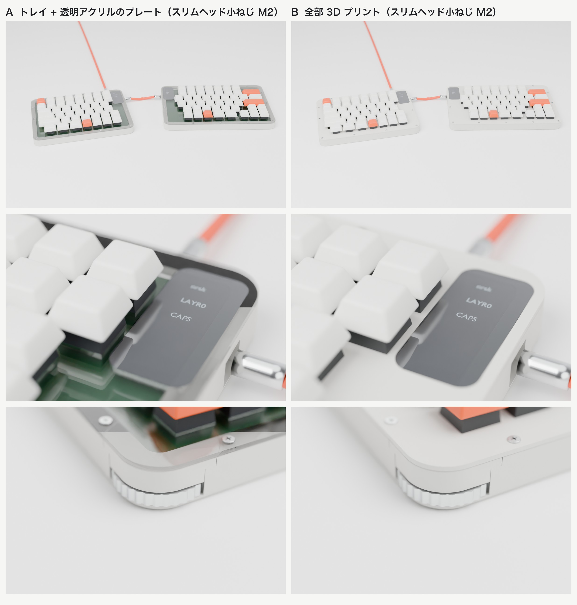

# nrsk 分割キーボード v2（基板と筐体）

KLE レイアウト（`kle/left.json`、`kle/right.json`）から生成した、左右分割・有線接続のキーボード基板です。
KiCad 10 のプロジェクト（回路図と配線済み基板）、製造用ガーバー、筐体（アクリルのレーザーカット用 DXF/SVG と 3D プリント用 STL）、BOM、QMK ファームウェア設定を含みます。

v2 では Pro Micro などのマイコンボードをやめ、RP2040 と QSPI フラッシュ、USB-C コネクタなどを基板に直接実装しました。
マイコンボード用に設けていた内側の帯（約 20 mm）がなくなり、基板はキー領域とほぼ同じ大きさになっています。

| 項目 | 内容 |
| --- | --- |
| キー数 | 左 44 + 右 48 = 92 |
| マイコン | RP2040（QFN-56、12 MHz 水晶、I/O 3.3 V）と 16 MB の QSPI フラッシュ W25Q128JV を左右に 1 組ずつ、裏面に直接実装 |
| USB | USB-C（USB 2.0）を左右それぞれに搭載 |
| 左右接続 | TRRS 3.5 mm（4 極ケーブル）、QMK の PIO シリアル（半二重、1 本の信号線）と 5 V 給電 |
| スイッチ | Cherry MX 互換、Kailh MX ホットスワップソケット（裏面） |
| 基板 | 2 層、左 172.6 × 125.3 mm、右 199.6 × 125.3 mm（キー配列の外周から 3 mm を基本に、上端を 5 mm、内側を左 9.4 mm・右 12.6 mm 広げて OLED・USB-C・TRRS・マイコンの場所を確保）、四隅は半径 4 mm の角丸、M2 取付穴 × 8（片側あたり） |
| 筐体 | 左 189.6 × 142.3 mm、右 216.6 × 142.3 mm、高さ 15.6 mm（3D プリント版）／ 16.5 mm（アクリル版）、いずれもプレート上面まで |
| 外観 | プレートは透明アクリル 1.5 mm、アクリル版の枠と底板はマットクリア 3 mm。プレートは外周の切り欠きなし（USB-C と TRRS は基板の裏面に実装し、プラグは基板の下を通る）。3D プリントのトレイは外周の角をフィレット加工 |
| 表示 | 0.91 インチ OLED（128×32）を左右に 1 枚ずつ、プレートと面一のハーフミラーアクリルのカバー付き。高さは増えない |
| ホイール | 左上と右上の角にサムホイール（磁気角度センサー AS5600 で読み取り）。高さは増えない |
| 3D ビューア | http://www.0x0c.me/spltnrskb/ 、組み立てガイドは http://www.0x0c.me/spltnrskb/assembly.html （GitHub Pages、`main` への Push で自動更新） |


完成イメージ（Blender でレンダリング）です。筐体は 2 つの 3D プリント版を採用しています。左が A（3D プリントのトレイ + 透明アクリルのプレート）、右が B（プレートも 3D プリント）で、どちらもプレートは薄頭なべネジで留めます。



## 回路

各半分に同じ回路が載っています。Raspberry Pi の RP2040 設計ガイド（Hardware design with RP2040）の最小構成に、保護部品を加えた構成です。

| 機能 | 部品 |
| --- | --- |
| フラッシュ | W25Q128JVS（16 MB、SOIC-8 208 mil）、0.1 µF |
| クロック | 12 MHz 水晶（3225）、15 pF × 2、XOUT に 1 kΩ 直列 |
| 電源 | VCC（5 V）→ LDO AP2112K-3.3（入出力 1 µF）→ 3V3。コアの 1.1 V は RP2040 内蔵レギュレータ（VREG_VIN／VREG_VOUT に 1 µF） |
| 電源のパスコン | IOVDD × 6、DVDD × 2、USB_VDD、ADC_AVDD にそれぞれ 0.1 µF、3V3 に 10 µF |
| USB | 27 Ω × 2（D+/D−）、CC 用 5.1 kΩ × 2（USB-C のデバイス認識用）、ESD 保護 USBLC6-2SC6 |
| 電源経路 | VBUS → ポリスイッチ 500 mA → ショットキーダイオード B5819W → VCC（5 V、TRRS で反対側にも給電） |
| リセットと書き込み | RUN を 10 kΩ でプルアップしたリセットスイッチ（裏面）。BOOTSEL は QSPI_SS から 1 kΩ を通したはんだジャンパー |
| 左右判定 | GP0 を 10 kΩ で左は 3V3、右は GND に接続 |

- ショットキーダイオードは逆流を防ぎます。TRRS で給電されている側の USB-C の VBUS には電圧が出ないので、両方の USB を挿してもホスト側に電流が逆流しません。USB を挿していない側が自分をマスターだと誤判定することもありません。
- RP2040 はブートローダーを ROM に持っています。フラッシュが空のときは USB を挿すだけで `RPI-RP2` ドライブとして見え、UF2 ファイルをコピーすれば書き込めます。一度 QMK を書き込んだあとは、リセットスイッチを素早く 2 回押すと同じ書き込みモードに入ります。ISP 書き込み器は必要ありません。
- OLED と AS5600 は 3.3 V で動かします。AS5600 は 3.3 V 動作の指定どおり VDD5V と VDD3V3 をつないでいます。

### マルチプレクサは不要

片側のマトリクスは 6 行 × 8 列で、使う GPIO は 14 本です。
RP2040 の GPIO は 30 本あるので、シリアル通信 1 本、左右判定 1 本、I2C 2 本を足しても十分に足ります。
右側の `\` キーは、配線上は行 0 の列 7 に割り当てて、左右とも 6 × 8 のマトリクスにそろえています（QMK の分割キーボードは左右の列数が同じである必要があるため）。

### ピン割り当て（左右共通）

| 用途 | GPIO |
| --- | --- |
| ROW0〜ROW5 | GP4〜GP9 |
| COL0〜COL7 | GP10〜GP14、GP16〜GP18（GP15 は QFN の角で配線しにくいため使わない） |
| I2C1（OLED と AS5600） | SDA = GP2、SCL = GP3 |
| 左右間データ | GP1、TRRS の Tip |
| 左右判定 | GP0 |
| 予備 | GP15、GP19〜GP29 |

TRRS の配線は Tip = DATA、Ring2 = VCC（5 V）、Sleeve = GND で、Ring1 は未接続です。

## 配置

- 表面: スイッチだけです。スイッチプレートより上に出る部品はありません。
- 裏面: ホットスワップソケット、ダイオード、RP2040 とフラッシュ・LDO などの周辺部品、リセットスイッチ、BOOTSEL パッド、USB-C、TRRS。
- USB-C は奥の辺（上端）の内側寄りに置き、ケーブルを後ろへ出します。TRRS は内側の辺の上寄り、OLED の裏にあたる位置で、左右とも同じ高さなのでケーブルがまっすぐ渡ります。どちらも差込口を基板の端にそろえています。マイコンはその 2 つの間の裏面にあります。
- 基板と筐体は、左右それぞれのキー配列にぴったり合わせた大きさです（左は OLED の分だけ内側を広げています）。マイコンは裏面に置いています。
- 2 u 以上のキー（左 Shift 2.25 u、右 Backspace 2 u、右 Enter 2.25 u）には PCB マウント型スタビライザの穴があります。
- 配線ルールは信号線 0.2 mm、電源線 0.4 mm、クリアランス 0.2 mm、ビア 0.6/0.3 mm です。最小配線幅は 0.15 mm で、USB-C の細いピンに入る部分だけで使っています。JLCPCB などの標準仕様（最小 0.127 mm）で製造できます。
- マイコン周りの部品番号はシルクに収まらないため、Fab 層に入れています。半田付けには `fab/<side>/nrsk-<side>-assembly-back.pdf`（裏面の実装図、左右反転済み）を使ってください。配線の確認には `fab/<side>/nrsk-<side>-copper.pdf` を使えます（1 ページ目が表面 F.Cu、2 ページ目が裏面 B.Cu で、どちらも外形付き）。

## サムホイール（角のダイヤル）

左半分の左上、右半分の右上の角に、親指でなぞって回すサムホイールを付けています。


- 形: 直径 29.2 mm、厚さ 4.1 mm のホイールで、外周に 32 山の丸い歯（深さ 0.5 mm）があります。歯は指のすべり止めとクリックを兼ねます。角の丸みと同心に置いていて、縁が角から約 3.5 mm、両側面から約 1 mm 出ます。
- 位置: 基板と底のすき間（7 mm）に水平に寝かせています。壁の下側だけを切り欠くので、プレートと壁の上部は切れ目がありません。キーボードの高さも変わりません。
- 検出: ホイール上面に径方向着磁の磁石（直径 6 mm × 厚さ 1.5 mm）を埋め、真上の基板裏面にある磁気角度センサー AS5600 で角度を読みます。非接触で、磁石とセンサーのすき間は約 0.65 mm です。AS5600 は OLED と同じ I2C（GP2 / GP3、アドレス 0x36）につながるので、追加のピンは要りません。
- 軸: 3D プリント版はトレイの床から立てた軸（直径 3.8 mm）、アクリル版は底板の下から通す M3 ネジを軸にします。ホイールの下面には軸穴（直径 4 mm × 深さ 2 mm）があります。
- クリック: ケースの内側にある頑丈なブロックに M3 のボールプランジャー（NBK PAFS-3 など、金属のばねと鋼球入りのねじ）を横向きにねじ込み、鋼球をホイールの歯の谷に当てます。1 山ごとにカチッと止まり、1 回転 32 クリックで、ファームウェアの 1 ステップと一致します。押す力は横向きで軸が受けるので、ホイールは浮きません。3D プリントの部分はたわまないので折れる心配がなく、ねじ込み量でクリックの重さを調整できます。3D プリント版はブロックがトレイと一体、アクリル版は別に印刷したブロック（`case/print/<side>-detent.stl`）を底板の下から M2 × 6 mm のタッピングネジ 2 本で留めます。
- 左の Esc キー: AS5600 とホットスワップソケットが重ならないよう、Esc のスイッチだけ 180 度回して（ソケットを下側にして）取り付けます。キーキャップの向きや打鍵感は変わりません。
- ファームウェア: `nrsk.c` で 5 ms ごとに角度を読み、ホイールがクリックの山を越えて次の谷へ半分以上進んだところで `dial_update_user()` を 1 回呼びます（山の上で止まっても数がばたつかないよう、少しヒステリシスを持たせています）。USB をつないでいない側のホイールは、左右間の通信で送ります。

| | 左ホイール | 右ホイール |
| --- | --- | --- |
| 回す（レイヤー 0） | 音量 | ページ上下 |
| 回す（レイヤー 1） | 画面の明るさ | カーソル左右 |

割り当ては `keymap.c` の `dial_update_user()` で変更できます。1 回転のクリック数は `gen/layout.py` の `WHEEL_DETENTS` で、ホイールの歯の数とファームウェアの `DIAL_STEP` が同時に変わります。

検討段階の記録として、側面ダイヤルの 2 タイプ（サムホイール型と横向きノブ型）を比べたレンダリングは [docs/img/dial-study/dial-grid.jpg](docs/img/dial-study/dial-grid.jpg) にあります。サムホイール型を採用し、角に置く形にしました。

## OLED

左右に 0.91 インチの OLED モジュール（128×32、SSD1306、I2C）を 1 枚ずつ付けています。

- 配線: マイコンの PD0（SCL）と PD1（SDA）に接続し、4.7 kΩ でプルアップしています。モジュールのピン順は GND / VCC / SCL / SDA です。VCC と GND が逆のモジュールもあるので、購入前に確認してください。
- 配置: 左右とも内側の端、1〜2 段目の高さに縦向きで置き、上端からの位置をそろえています。右はキーのない切り欠きに収まり、左は基板の内側を 4.7 mm 広げて、スイッチとの隙間を右と同じ 2.45 mm にしています。
- 取り付け: ピンヘッダの黒い樹脂スペーサーを外し、OLED のガラス上面が基板の上面から 2.5 mm の高さになるように、モジュールを基板に近づけて半田付けします。
- 筐体: OLED を中心にした角丸長方形（窓より一回り 5 mm 大きい）のハーフミラーのアクリル（`case/laser/<side>-oled-cover`）を、プレートの切り欠きにはめ込みます。ハーフミラーのアクリルは 2 mm 厚からしか市販されていないため、3D プリント版は壁の上面をカバーの下だけ 0.5 mm 下げて、上面をプレートと面一にしています（アクリル版は 0.5 mm 高くなります）。カバーは OLED のガラス面と壁の上面に透明両面テープで貼り、ネジは使いません。消灯中は鏡のように見え、点灯すると表示が透けて見えます。カバーの周りに余白を取るため、基板の上端を 5 mm 延ばし、内側を左右とも約 4.6〜4.7 mm 広げています。
- 表示: QMK の `oled_task_user` で、USB をつないだ側にレイヤーと Caps Lock、もう一方に WPM を表示します（`firmware/qmk/keyboards/nrsk/keymaps/default/keymap.c`）。

### OLED の高さ・角度の比較

検討段階の記録です（採用したのは、上に書いたプレートと面一のハーフミラーのカバーです）。画像は当時の基板・筐体の形で描いています。
キーキャップに隠れにくい OLED の付け方を、高さ 0〜13 mm の 4 案（A〜D）と傾斜 2 案（E・F）で比べました。
座った目線と寄りのレンダリングを、取り付け方式ごとに [docs/img/render-grid.jpg](docs/img/render-grid.jpg) にまとめています。
台座の形状は `gen/oled_variants.py`、レンダリングは `gen/render_all.sh` で作り直せます。既定は確認用のプレビュー（長辺 1200 px、数分）で、`FINAL=1 ./gen/render_all.sh` とすると高画質（長辺 2400 px）で出力します。
B〜F は OLED を基板の外側（壁の上）へ移すため、基板のコネクタから配線でつなぐ前提です。

## 筐体

3D プリントとアクリルのレーザーカットのどちらでも作れるよう、同じ寸法のサンドイッチ構造にしています。3D プリントのトレイを使う版は 2 種類あり、どちらも正式な仕様です。

- **A：トレイ + 透明アクリルのプレート** — トレイは 3D プリント、スイッチプレートは透明アクリル 1.5 mm（`case/laser/<side>-plate`）。プレート越しに基板が見えます。
- **B：全部 3D プリント** — プレートも 3D プリント（`case/print/<side>-plate.stl`）。スイッチの爪が掛かる周りだけ 1.5 mm で、ほかは裏に 2 mm の補強があり、上下を逆にして印刷します。中は見えません。
- **アクリル版** — 底板・枠・プレートをすべてアクリルのレーザーカットで積み重ねます。

A と B のプレートは、壁の上面のヒートセットインサートに薄頭なべネジ（スリムヘッド小ねじ M2 × 5 mm、頭 φ4.0 × 高さ 0.5 mm）で留めます。頭が薄く十字穴も浅いので、締めすぎに注意してください。ハーフミラーの OLED カバーはどの版でも共通です。
基板は 8 か所の取り付け穴で筐体の底に固定し、スイッチプレートは外周のネジで留めます。
寸法の基準は MX の規格（プレート上面から基板上面まで 5.0 mm）です。


| 部分 | A / B（3D プリントのトレイ、`case/print/`） | アクリル版（`case/laser/`） |
| --- | --- | --- |
| 底 | トレイの床 2 mm、外周の下端 R2・上端 R0.6 のフィレット | 底板 3 mm（`<side>-bottom`） |
| 壁 | トレイと一体、幅 8 mm、高さ 14.1 mm。ホイールの上は外せる角キャップ（`<side>-wheel-cap.stl`） | 枠 3 mm × 4 枚（差込口のある枠には切り欠き、`frame4` は切り欠きなし） |
| 基板の支持 | 床から高さ 7 mm のボス（φ4.6、下穴 φ1.6）に M2 × 6 mm タッピングネジ | M2 × 7 mm スペーサーに、上から M2 × 4 mm、下から M2 × 5 mm のネジ |
| プレート | A：透明アクリル 1.5 mm／B：3D プリント（補強付き）。壁上面の M2 ヒートセットインサートに薄頭なべネジ M2 × 5 mm で固定 | 透明アクリル 1.5 mm、外周を M2 × 20 mm とナットで底板まで共締め |
| ネジ本数 | 外周 左 10・右 12、基板 左右 8 ずつ | 同じ |

設計上の注意点です。

- 取り付け穴は、スペーサーやボスが裏面のパッドや配線に触れない位置に置きました（穴の中心から銅箔まで 2.75 mm 以上）。穴の周りには配線禁止の領域を設けています。
- USB-C と TRRS は基板の裏面にあり、プラグは基板の下を通ります。そのためスイッチプレートには切り欠きがありません。開口は壁の下側（基板の上面より下）だけで、3D プリント版は壁の上部、アクリル版は一番上の枠 `frame4` が切れ目のない輪として残ります。
- 基板を床から 7 mm 浮かせているのは、TRRS プラグ（直径 9 mm 程度まで）が基板の下を通るためです。
- 底面には、リセットスイッチをピンで押すための φ3 mm の穴があります。
- トレイの幅は左 189.6 mm、右 216.6 mm です。右は 220 mm 角の造形範囲（Ender-3 など）にぎりぎり入る大きさなので、余裕のある 250 mm 角以上の機種（Bambu Lab A1/P1/X1、Prusa MK4 など）を勧めます。180 mm 角の機種（A1 mini など）では入りません。
- B のプレートは PETG など粘りのある材料が向いています。A のプレートと同じ DXF から、アクリルのほか FR4 1.6 mm やアルミ 1.5 mm で外注することもできます。
- アクリル版の枠 4 枚の合計は 12.0 mm です。設計上の理想値 12.1 mm より 0.1 mm 薄く、その分プレートがスイッチを押し下げますが、アクリル板自体の厚み公差（±0.2 mm 程度）の範囲内です。気になる場合は、スペーサーの下に薄いワッシャーを挟んでください。
- レーザーカットを外注するときは、DXF（単位 mm、全線カット）をそのまま入稿できます。スイッチ穴 14.0 mm はカット幅の補正が前提なので、補正の有無を業者に確認してください。

`case/preview/viewer.html` は組み立て状態を回して見られる 3D ビューアです。http://www.0x0c.me/spltnrskb/ で公開しています（`.github/workflows/pages.yml`）。
基板は KiCad の 3D プレビューと同じ部品実装済みの姿で表示します（`gen/export_3d.py` で KiCad から書き出し、`gen/glb_mesh.py` でブラウザ向けに軽量化）。
「分解表示」をオンにすると、スライダーでレイヤーどうしの間隔を 0〜40 mm で変えられます。

組み立て手順は、同じデータを使ったインタラクティブな組み立てガイド（`case/preview/assembly.html`、公開版は http://www.0x0c.me/spltnrskb/assembly.html ）で確認できます。手順ごとに部品が所定の位置に入るアニメーションと説明が出て、A・B・アクリル版と左右を切り替えられます。

## 部品表（BOM）

左右合計の部品表を [bom/nrsk-bom.csv](bom/nrsk-bom.csv)（Excel で開ける UTF-8）と [bom/nrsk-bom.md](bom/nrsk-bom.md) にまとめました。
基板の電子部品、キースイッチとキーキャップ、筐体のネジ類と材料、ケーブルまで含みます。
数量は回路図と筐体のデータから自動で数えているので、レイアウトを変えても `./build.sh` で更新されます。
片側ごとの KiCad の部品表は `fab/<side>/nrsk-<side>-bom.csv` にあります。

各行には、実際に買える部品のメーカー型番・購入先・参考単価・商品ページの URL を付けています（2026-10-04 時点で、すべてのページを開いて型番と仕様を確認済み）。
電子部品は LCSC（JLCPCB の実装サービスでもそのまま使える部品番号）、キーボード部品は遊舎工房、ネジやスペーサーは MonotaRO、アクリル加工ははざいや、基板は JLCPCB が中心です。
購入先は [gen/bom_sources.json](gen/bom_sources.json) にまとめてあり、価格や在庫は変わるので発注前に確認してください。

発注前に特に確認が必要な部品があります。

- **水晶振動子**：Raspberry Pi のリファレンスと同じ Abracon ABM8-272-T3（12 MHz、負荷容量 10 pF）を 15 pF のコンデンサと組み合わせます。安価な YXC X322512MSB4SI は負荷容量 20 pF なので、そのままでは合いません。
- **フラッシュ**：W25Q128JVSIQ は LCSC に 2 つの部品番号があり、よく使われる C97521 は確認時に在庫切れでした。BOM には在庫のある C113767 を載せています。
- **TRRS ジャック**：基板のパッドは Qingpu WQP-PJ320D の寸法です。LCSC の 2 品（C431535、C95562）は EasyEDA のフットプリントと照合し、固定ピンの間隔 7.0 mm が一致し、端子位置の差も 0.1 mm 以内でパッドに載ることを確認しました。
- **磁石**：設計は φ6 × 1.5 mm の径方向着磁ですが、国内で在庫のあるものが見つかりませんでした。BOM には DigiKey の φ6 × 2.5 mm を載せていますが、そのままではホイールのポケットに入りません。
- **OLED**：遊舎工房の商品ページにはピン順の記載がありません。GND/VCC/SCL/SDA の順かを現物で確認してください。

主な部品（左右合計）は次のとおりです。

| 部品 | 数量 |
| --- | --- |
| ATmega32U4-AU（TQFP-44） | 2 |
| USB-C レセプタクル HRO TYPE-C-31-M-12 | 2 |
| TRRS ジャック PJ-320D | 2 |
| ダイオード 1N4148W | 92 |
| MX 互換スイッチ／Kailh ホットスワップソケット | 各 92 |
| 0805 の抵抗とコンデンサ | 抵抗 14、コンデンサ 16 |
| M2 ネジ類 | 外周 25 本、基板固定 16 か所 |

## ファイル構成

```text
left/, right/        KiCad プロジェクト（.kicad_pro / .kicad_sch / .kicad_pcb）、ERC と DRC のレポート
lib/nrsk.pretty      自作フットプリント（ホットスワップ MX、1u〜2.25u）
fab/<side>/          ガーバーとドリルの zip、BOM（CSV）、回路図（PDF）、裏面の実装図（PDF）、両面の配線図（PDF）
case/laser/          アクリル用 DXF と SVG（<side>-plate / frame1〜4 / bottom / oled-cover）
case/print/          3D プリント用 STL（<side>-tray / plate）
case/preview/        3D ビューア、重ね合わせ図、断面図
docs/img/render-*    完成イメージ（gen/render_blender.py を Blender で実行して生成）
docs/img/oled-study/ OLED の高さ・角度の比較レンダリング
bom/                 左右合計の BOM（CSV / Markdown）
firmware/qmk/        QMK のキーボード定義（keyboard.json）と既定のキーマップ
gen/                 生成スクリプト（KLE の解析、回路図・基板の生成、部品の自動配置、自動配線、QMK 定義）
build.sh             一括再生成（必要なツールは下の「環境の準備」を参照）
tools/, .venv/       Freerouting と Python 仮想環境（Git の管理対象外）
```

KLE を編集した場合は `./build.sh` を実行すると、回路図、基板、配線、ERC/DRC、製造データ、筐体、BOM、QMK 定義をすべて作り直します。
行の配線とダイオード周りはスクリプトで規則的に引き、残りを Freerouting（`tools/freerouting-2.4.1.jar`）に任せています。
Freerouting の結果には乱数によるばらつきがあるため、未配線が 0 になるまで最大 25 回やり直します。

## 環境の準備

`./build.sh` で全データを作り直すには、次のツールが必要です（macOS で確認）。

- KiCad 10（`~/Applications/KiCad` または `/Applications/KiCad`）
- OpenJDK と Freerouting 2.4.1
- 筐体の生成用に Python 3 の仮想環境と manifold3d
- 完成イメージのレンダリング用に Blender（任意）

```bash
brew install openjdk
```

```bash
mkdir -p tools && curl -L -o tools/freerouting-2.4.1.jar https://github.com/freerouting/freerouting/releases/download/v2.4.1/freerouting-2.4.1.jar
```

```bash
python3 -m venv .venv && .venv/bin/pip install manifold3d numpy matplotlib
```

KiCad の標準ライブラリにない 3D モデルは、`./build.sh` の最初に `gen/fetch_3d.sh` が `tools/` に取ってきます（リポジトリには含めません）。

- MX スイッチ、Kailh ホットスワップソケット、スタビライザー：[kiswitch](https://github.com/kiswitch/kiswitch)（CC-BY-SA 4.0、設計データへの利用は例外規定あり）
- USB-C（C165948）と TRRS ジャック（C431535）：LCSC／EasyEDA のモデルを [easyeda2kicad](https://pypi.org/project/easyeda2kicad/) で取得
- OLED モジュール：`gen/models3d.py` で作る簡易モデル（`lib/nrsk.3dshapes/`）

これがあれば KiCad の 3D ビューアでも、すべての部品が実装された状態で表示されます。

```bash
blender -b -P gen/render_blender.py -- --samples 192 --res 1800
```

## ファームウェア

ファームウェアは QMK で作ります。キーボード定義は `firmware/qmk/keyboards/nrsk` にあります。
左右とも同じファームウェアを書き込みます。左右の判定は基板の配線（GP0）で決まるので、左用・右用を分ける必要はありません。

### 1. QMK の準備（初回のみ）

```bash
brew install qmk/qmk/qmk
```

```bash
qmk setup
```

`qmk setup` は `~/qmk_firmware` に QMK を取得し、ビルドに使う ARM のコンパイラなどもまとめて入れます。
Windows では [QMK MSYS](https://msys.qmk.fm/) を使ってください。
Homebrew の `arm-none-eabi-gcc` は標準 C ライブラリ（newlib）を含まないためビルドできません。`qmk setup` が入れるツールチェーンか、Arm 公式の [Arm GNU Toolchain](https://developer.arm.com/downloads/-/arm-gnu-toolchain-downloads)（arm-none-eabi）を使ってください。

### 2. キーボード定義をコピーしてビルドする

```bash
cp -R firmware/qmk/keyboards/nrsk ~/qmk_firmware/keyboards/
```

```bash
qmk compile -kb nrsk -km default
```

ビルドが通ると `~/qmk_firmware/nrsk_default.uf2` ができます。

### 3. 書き込む（左右それぞれ 1 回ずつ）

RP2040 は ROM に USB ブートローダーを持っています。書き込み器もドライバも要りません。

1. TRRS ケーブルを外し、書き込む側の半分だけを USB でパソコンにつなぎます。
2. その半分を書き込みモードにします。パソコンに `RPI-RP2` という USB ドライブが現れれば成功です。
   - 初めて書き込むとき（フラッシュが空）は、USB を挿すだけで書き込みモードになります。
   - 2 回目以降は、底面の穴からリセットスイッチをピンで素早く 2 回押します。
   - 一番左上のキーを押したまま USB ケーブルを挿しても入れます（Bootmagic）。左半分は Esc、右半分は F7 の左にある刻印なしのキーです。
   - どれも効かないときは、裏面の BOOTSEL パッド（JP1）をピンセットで短絡したまま USB を挿します。
3. `nrsk_default.uf2` を `RPI-RP2` ドライブにコピーします。コピーが終わると自動で再起動し、キーボードとして認識されます。コマンドで書き込む場合は次のとおりです（書き込みモードになるのを待ってから書き込みます）。

   ```bash
   qmk flash -kb nrsk -km default
   ```

4. もう片方も同じ手順で書き込みます。
5. 最後に TRRS ケーブルで左右をつなぎ、どちらか片方を USB でパソコンにつなぎます。USB をつないだ側がマスターになり、その側の OLED にレイヤーと Caps Lock、もう一方に WPM が表示されます。

### うまくいかないとき

- `RPI-RP2` ドライブが出ない場合は、USB ケーブルが充電専用でないか確認し、BOOTSEL パッドを短絡したまま挿し直してください。それでも出ない場合は、水晶・フラッシュ・3.3 V LDO の半田付けを確認してください。
- 左右が通信しない場合は、TRRS ケーブルが 4 極（TRRS）であることを確認してください。
- TRRS ケーブルは、USB をつないだまま抜き差ししないでください。

### キーマップ

既定のキーマップは KLE の刻印どおりで、`fn` を押している間はレイヤー 1 になります（矢印キーが Home/End/PgUp/PgDn、Backspace が Delete）。
KLE で刻印のないキー（左右の内側の列、計 12 キー）は `KC_NO` にしてあるので、好みに合わせて割り当ててください。
キーマップは `firmware/qmk/keyboards/nrsk/keymaps/default/keymap.c` を編集するか、自分用のフォルダ（例: `keymaps/mine/`）を作って `qmk compile -kb nrsk -km mine` でビルドします。

## 発注・組み立て前の確認事項

- DRC の警告 5 件は、TRRS ジャックと USB-C の差込口が基板端に掛かっていることによるシルクの警告です。差込口を基板の端に合わせるための意図的な配置です。
- RP2040 は 0.4 mm ピッチの QFN で、裏面のサーマルパッドも GND に半田付けする必要があります。手半田はホットエアかリフローが前提なので、JLCPCB などの部品実装サービスを使うのがおすすめです（BOM の LCSC 部品番号がそのまま使えます）。USB-C（0.5 mm ピッチ）も同様です。
- ホットスワップソケットのフットプリントは、一般的な Kailh CPG151101S11 の寸法で作った自作品です。1 枚目は実物のソケットと照合してください。
- TRRS ケーブルは、USB を接続したまま抜き差ししないでください。電源ピンが一瞬ショートして、マイコンを壊すおそれがあります。
- QMK のファームウェアは、現行の qmk_firmware（2026-10 時点）で `qmk compile -kb nrsk -km default` が通り、`nrsk_default.uf2`（約 84 KB）ができることを確認しています。実機での動作（キー入力、左右通信、OLED、ホイール）はまだ確認していません。
