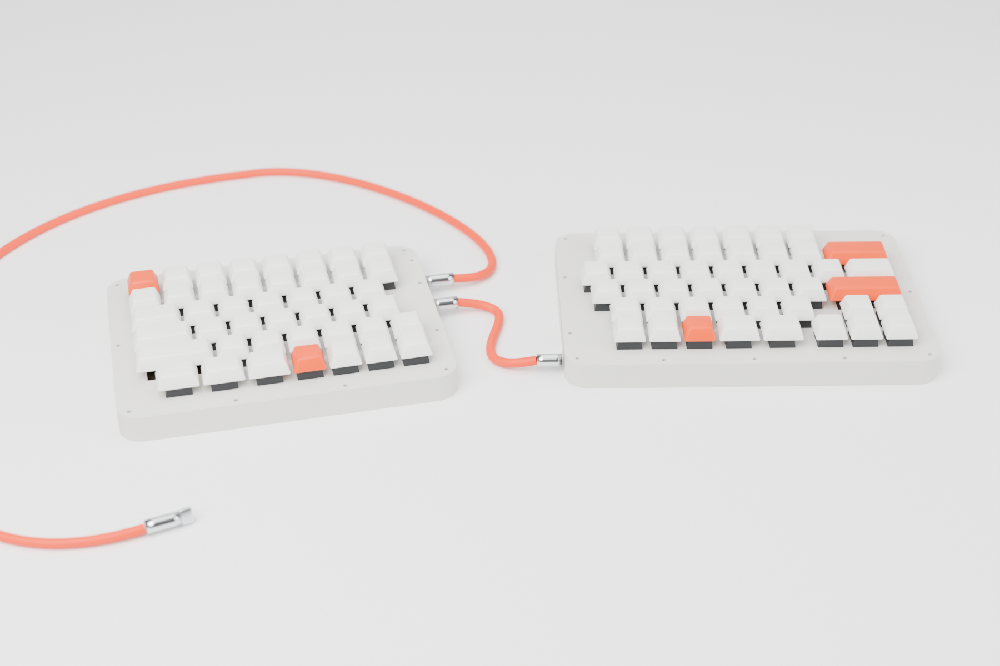
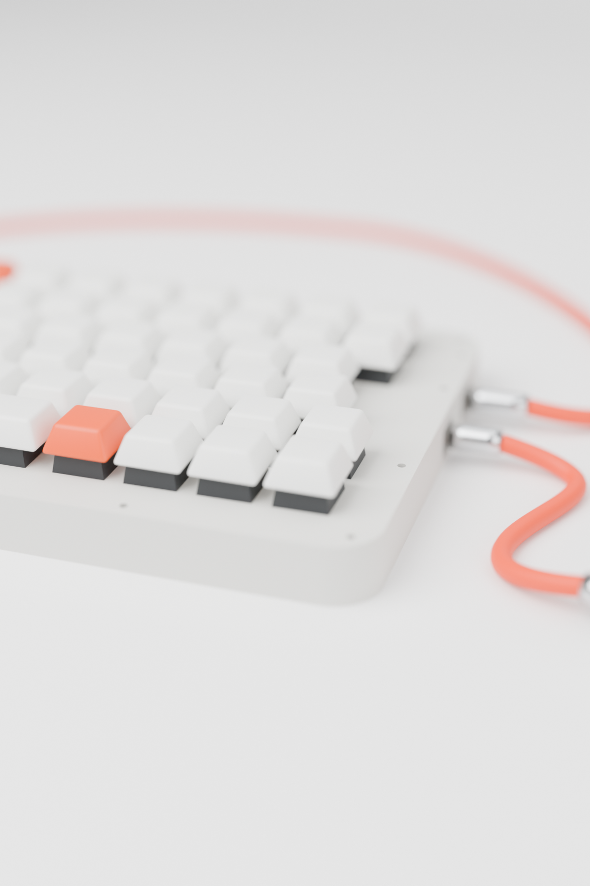

# nrsk 分割キーボード v2（基板と筐体）

KLE レイアウト（`kle/left.json`、`kle/right.json`）から生成した、左右分割・有線接続のキーボード基板です。
KiCad 10 のプロジェクト（回路図と配線済み基板）、製造用ガーバー、筐体（アクリルのレーザーカット用 DXF/SVG と 3D プリント用 STL）、BOM、QMK ファームウェア設定を含みます。

v2 では Pro Micro などのマイコンボードをやめ、ATmega32U4 と USB-C コネクタなどを基板に直接実装しました。
マイコンボード用に設けていた内側の帯（約 20 mm）がなくなり、基板はキー領域とほぼ同じ大きさになっています。

| 項目 | 内容 |
| --- | --- |
| キー数 | 左 44 + 右 48 = 92 |
| マイコン | ATmega32U4-AU（TQFP-44、16 MHz、5 V）を左右に 1 個ずつ、裏面に直接実装 |
| USB | USB-C（USB 2.0）を左右それぞれに搭載 |
| 左右接続 | TRRS 3.5 mm（4 極ケーブル）、QMK のソフトシリアル（半二重、1 本の信号線） |
| スイッチ | Cherry MX 互換、Kailh MX ホットスワップソケット（裏面） |
| 基板 | 2 層、左 163.2 × 120.3 mm、右 187.0 × 120.3 mm（キー外周から 3 mm の余白）、四隅は半径 4 mm の角丸、M2 取付穴 × 8（片側あたり） |
| 筐体 | 左 180.2 × 137.3 mm、右 204.0 × 137.3 mm、高さ 15.6 mm（3D プリント版）／ 16.5 mm（アクリル版）、いずれもプレート上面まで |
| 外観 | スイッチプレートは切り欠きなし（USB-C と TRRS は基板の裏面に実装し、プラグは基板の下を通る） |


完成イメージ（Blender でレンダリング、3D プリント版の筐体）です。




## 回路

各半分に同じ回路が載っています。ATmega32U4 の標準的な USB 接続回路に、保護部品を加えた構成です。

| 機能 | 部品 |
| --- | --- |
| クロック | 16 MHz 水晶（3225）、22 pF × 2 |
| 電源のパスコン | 0.1 µF × 4、10 µF × 1、UCAP 用 1 µF × 1 |
| USB | 22 Ω × 2（D+/D−）、CC 用 5.1 kΩ × 2（USB-C のデバイス認識用）、ESD 保護 USBLC6-2SC6 |
| 電源経路 | VBUS → ポリスイッチ 500 mA → ショットキーダイオード B5819W → VCC |
| リセットと書き込み | RESET を 10 kΩ でプルアップ、HWB を 10 kΩ でプルダウン、リセットスイッチ（裏面） |
| 左右判定 | PD3 を 10 kΩ で左は VCC、右は GND に接続 |

- ショットキーダイオードは逆流を防ぎます。TRRS で給電されている側の USB-C の VBUS には電圧が出ないので、両方の USB を挿してもホスト側に電流が逆流しません。USB を挿していない側が自分をマスターだと誤判定することもありません。
- ATmega32U4 は工場出荷時に DFU ブートローダーが書き込まれています。リセットスイッチを押すと、HWB のプルダウンによって DFU モードで起動し、USB 経由でファームウェアを書き込めます。ISP 書き込み器は必要ありません。

### マルチプレクサは不要

片側のマトリクスは 6 行 × 8 列で、使う GPIO は 14 本です。
ATmega32U4 の GPIO は 26 本あるので、シリアル通信 1 本と左右判定 1 本を足しても十分に足ります。
右側の `\` キーは、配線上は行 0 の列 7 に割り当てて、左右とも 6 × 8 のマトリクスにそろえています（QMK の分割キーボードは左右の列数が同じである必要があるため）。

### ピン割り当て（左右共通）

| 用途 | ポート（TQFP のピン番号） |
| --- | --- |
| ROW0〜ROW5 | PF4 (39), PF5 (38), PF6 (37), PF7 (36), PB1 (9), PB3 (11) |
| COL0〜COL7 | PD4 (25), PC6 (31), PD7 (27), PE6 (1), PB4 (28), PB5 (29), PB6 (30), PB2 (10) |
| 左右間データ | PD2 (20)、TRRS の Tip |
| 左右判定 | PD3 (21) |
| 予備 | PD0/PD1（I2C）、PB0、PB7、PC7、PD5、PD6、PF0、PF1 |

TRRS の配線は Tip = DATA、Ring2 = VCC、Sleeve = GND で、Ring1 は未接続です。

## 配置

- 表面: スイッチだけです。スイッチプレートより上に出る部品はありません。
- 裏面: ホットスワップソケット、ダイオード、ATmega32U4 と周辺部品、リセットスイッチ、USB-C、TRRS。
- USB-C と TRRS は内側の端に置き、差込口を基板の端にそろえています。左は 1〜2 段目に USB-C、3 段目に TRRS、右は 5〜6 段目に USB-C と TRRS があります。
- 2 u 以上のキー（左 Shift 2.25 u、右 Backspace 2 u、右 Enter 2.25 u）には PCB マウント型スタビライザの穴があります。
- 配線ルールは信号線 0.2 mm、電源線 0.4 mm、クリアランス 0.2 mm、ビア 0.6/0.3 mm です。最小配線幅は 0.15 mm で、USB-C の細いピンに入る部分だけで使っています。JLCPCB などの標準仕様（最小 0.127 mm）で製造できます。
- マイコン周りの部品番号はシルクに収まらないため、Fab 層に入れています。半田付けには `fab/<side>/nrsk-<side>-assembly-back.pdf`（裏面の実装図、左右反転済み）を使ってください。

## 筐体

3D プリントとアクリルのレーザーカットのどちらでも作れるよう、同じ寸法のサンドイッチ構造にしています。
基板は 8 か所の取り付け穴で筐体の底に固定し、スイッチプレートは外周のネジで留めます。
寸法の基準は MX の規格（プレート上面から基板上面まで 5.0 mm）です。


| 部分 | 3D プリント版（`case/print/`） | アクリル版（`case/laser/`） |
| --- | --- | --- |
| 底 | トレイの床 2 mm | 底板 3 mm（`<side>-bottom`） |
| 壁 | トレイと一体、幅 8 mm、高さ 14.1 mm | 枠 3 mm × 4 枚（`frame1`〜`frame3` は差込口の切り欠きあり、`frame4` は切り欠きなし） |
| 基板の支持 | 床から高さ 7 mm のボス（φ4.6、下穴 φ1.6）に M2 × 6 mm タッピングネジ | M2 × 7 mm スペーサーに、上から M2 × 4 mm、下から M2 × 5 mm のネジ |
| プレート | 1.5 mm（`<side>-plate.stl`）、壁上面の M2 ヒートセットインサートに M2 × 5 mm で固定 | 1.5 mm（`<side>-plate`）、外周を M2 × 20 mm とナットで底板まで共締め |
| ネジ本数 | 外周 左 12・右 13、基板 左右 8 ずつ | 同じ |

設計上の注意点です。

- 取り付け穴は、スペーサーやボスが裏面のパッドや配線に触れない位置に置きました（穴の中心から銅箔まで 2.75 mm 以上）。穴の周りには配線禁止の領域を設けています。
- USB-C と TRRS は基板の裏面にあり、プラグは基板の下を通ります。そのためスイッチプレートには切り欠きがありません。開口は壁の下側（基板の上面より下）だけで、3D プリント版は壁の上部、アクリル版は一番上の枠 `frame4` が切れ目のない輪として残ります。
- 基板を床から 7 mm 浮かせているのは、TRRS プラグ（直径 9 mm 程度まで）が基板の下を通るためです。
- 底面には、リセットスイッチをピンで押すための φ3 mm の穴があります。
- 右側のトレイは幅 204 mm です。造形範囲が 220 mm 角以上の 3D プリンタ（Ender-3、Bambu Lab A1/P1/X1、Prusa MK4 など）で印刷できます。180 mm 角の機種（A1 mini など）では入りません。
- 3D プリント版のプレートは 1.5 mm と薄いので、PETG など粘りのある材料が向いています。アクリル版と同じ DXF から、アクリル 1.5 mm、FR4 1.6 mm、アルミ 1.5 mm のプレートを外注することもできます。
- アクリル版の枠 4 枚の合計は 12.0 mm です。設計上の理想値 12.1 mm より 0.1 mm 薄く、その分プレートがスイッチを押し下げますが、アクリル板自体の厚み公差（±0.2 mm 程度）の範囲内です。気になる場合は、スペーサーの下に薄いワッシャーを挟んでください。
- レーザーカットを外注するときは、DXF（単位 mm、全線カット）をそのまま入稿できます。スイッチ穴 14.0 mm はカット幅の補正が前提なので、補正の有無を業者に確認してください。

`case/preview/viewer.html` は組み立て状態を回して見られる 3D ビューアです。

## 部品表（BOM）

左右合計の部品表を [bom/nrsk-bom.csv](bom/nrsk-bom.csv)（Excel で開ける UTF-8）と [bom/nrsk-bom.md](bom/nrsk-bom.md) にまとめました。
基板の電子部品、キースイッチとキーキャップ、筐体のネジ類と材料、ケーブルまで含みます。
数量は回路図と筐体のデータから自動で数えているので、レイアウトを変えても `./build.sh` で更新されます。
片側ごとの KiCad の部品表は `fab/<side>/nrsk-<side>-bom.csv` にあります。

主な部品（左右合計）は次のとおりです。

| 部品 | 数量 |
| --- | --- |
| ATmega32U4-AU（TQFP-44） | 2 |
| USB-C レセプタクル HRO TYPE-C-31-M-12 | 2 |
| TRRS ジャック PJ-320D | 2 |
| ダイオード 1N4148W | 92 |
| MX 互換スイッチ／Kailh ホットスワップソケット | 各 92 |
| 0805 の抵抗とコンデンサ | 抵抗 14、コンデンサ 16 |
| M2 ネジ類 | 外周 25 本、基板固定 16 か所 |

## ファイル構成

```text
left/, right/        KiCad プロジェクト（.kicad_pro / .kicad_sch / .kicad_pcb）、ERC と DRC のレポート
lib/nrsk.pretty      自作フットプリント（ホットスワップ MX、1u〜2.25u）
fab/<side>/          ガーバーとドリルの zip、BOM（CSV）、回路図（PDF）、裏面の実装図（PDF）
case/laser/          アクリル用 DXF と SVG（<side>-plate / frame1〜4 / bottom）
case/print/          3D プリント用 STL（<side>-tray / plate）
case/preview/        3D ビューア、重ね合わせ図、断面図
docs/img/render-*    完成イメージ（gen/render_blender.py を Blender で実行して生成）
bom/                 左右合計の BOM（CSV / Markdown）
firmware/qmk/        QMK のキーボード定義（keyboard.json）と既定のキーマップ
gen/                 生成スクリプト（KLE の解析、回路図・基板の生成、部品の自動配置、自動配線、QMK 定義）
build.sh             一括再生成（必要なツールは下の「環境の準備」を参照）
tools/, .venv/       Freerouting と Python 仮想環境（Git の管理対象外）
```

KLE を編集した場合は `./build.sh` を実行すると、回路図、基板、配線、ERC/DRC、製造データ、筐体、BOM、QMK 定義をすべて作り直します。
行の配線とダイオード周りはスクリプトで規則的に引き、残りを Freerouting（`tools/freerouting-2.4.1.jar`）に任せています。
Freerouting の結果には乱数によるばらつきがあるため、未配線が 0 になるまで最大 25 回やり直します。

## 環境の準備

`./build.sh` で全データを作り直すには、次のツールが必要です（macOS で確認）。

- KiCad 10（`~/Applications/KiCad` または `/Applications/KiCad`）
- OpenJDK と Freerouting 2.4.1
- 筐体の生成用に Python 3 の仮想環境と manifold3d
- 完成イメージのレンダリング用に Blender（任意）

```bash
brew install openjdk
```

```bash
mkdir -p tools && curl -L -o tools/freerouting-2.4.1.jar https://github.com/freerouting/freerouting/releases/download/v2.4.1/freerouting-2.4.1.jar
```

```bash
python3 -m venv .venv && .venv/bin/pip install manifold3d numpy matplotlib
```

```bash
blender -b -P gen/render_blender.py -- --samples 192 --res 1800
```

## ファームウェア

`firmware/qmk/keyboards/nrsk` を `qmk_firmware/keyboards/` にコピーしてから、ビルドします。

```bash
qmk compile -kb nrsk -km default
```

書き込むときは、裏面のリセットスイッチを押して DFU モードにしてから `qmk flash -kb nrsk -km default` を実行します。
左右それぞれに 1 回ずつ書き込んでください。

既定のキーマップは KLE の刻印どおりで、`fn` を押している間はレイヤー 1 になります（矢印キーが Home/End/PgUp/PgDn、Backspace が Delete）。
KLE で刻印のないキー（左右の内側の列、計 12 キー）は `KC_NO` にしてあるので、好みに合わせて割り当ててください。

## 発注・組み立て前の確認事項

- DRC の警告 5 件は、TRRS ジャックと USB-C の差込口が基板端に掛かっていることによるシルクの警告です。差込口を基板の端に合わせるための意図的な配置です。
- USB-C（0.5 mm ピッチ）と TQFP-44（0.8 mm ピッチ）は、細めのこて先とフラックスがあれば手半田できます。USB-C は難易度が高いので、JLCPCB などの部品実装サービスを使う方法もあります。
- ホットスワップソケットのフットプリントは、一般的な Kailh CPG151101S11 の寸法で作った自作品です。1 枚目は実物のソケットと照合してください。
- TRRS ケーブルは、USB を接続したまま抜き差ししないでください。電源ピンが一瞬ショートして、マイコンを壊すおそれがあります。
- QMK のビルドはこの環境では実行していません。`keyboard.json` の記法は QMK の現行のデータ駆動形式に合わせてあります。
