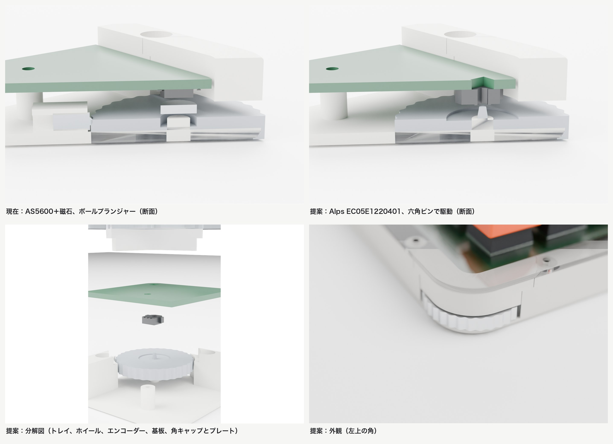

# サムホイールの市販ロータリーエンコーダー化

> ステータス: ドラフト
> 対象: `gen/`（回路図、基板、ケース、QMK の各生成スクリプト）、`firmware/qmk/keyboards/nrsk/`、`README.md`
> 関連: [README のサムホイールの節](../../README.md#サムホイール角のダイヤル)

角のサムホイールの読み取りを、磁気角度センサー AS5600 と磁石とボールプランジャーの組み合わせから、市販のロータリーエンコーダー Alps EC05E1220401 に置き換える。エンコーダーは基板の裏へ下向きに付け、ホイール上面の六角ピンで回す。クリックはエンコーダーが内蔵するものを使い、ファームウェアは QMK 標準のエンコーダー機能で読む。

## 1. なにをつくるのか

### 完成後の振る舞い

ホイールの位置、直径 29.2 mm、厚さ 4.1 mm、角から縁が出る量は今と変わらない。外から見て変わるのは手触りだけである。

- **クリック数**：1 回転 12 クリックになる（今は 32）。1 クリックは 30° で、縁の上で約 7.6 mm にあたる。
- **クリックの重さ**：エンコーダーのクリックトルクは 1.6 ± 1.3 mN·m である。ホイールの縁（半径 14.6 mm）で約 0.11 N、ばらつきの範囲で 0.02〜0.2 N になる。今のボールプランジャーと違い、重さは調整できない。
- **キー割り当て**：今と同じ。左ホイールは音量（レイヤー 1 で画面の明るさ）、右ホイールはページ上下（レイヤー 1 でカーソル左右）を送る。1 クリックで 1 回送るので、1 回転あたりの変化量は今の 12/32 になる。
- **左右**：USB をつないでいない側のホイールも、今と同じように効く。

外観、断面、分解図は [docs/img/encoder-study/sheet.jpg](../img/encoder-study/sheet.jpg) にある。

### やらないこと

- **ホイールの直径と位置の変更**：直径を変えると、クリックの重さを縁で感じる力は変えられる。ただし、角の切り欠き、ケースのネジ、スタンドオフの配置を作り直す必要があり、今回の目的（読み取り方式の置き換え）から外れる。実機でクリックが軽すぎた場合に、別件として扱う。
- **押し込みスイッチ**：EC05E1220401 には押し込みスイッチがない。押し込み付きの候補（Panasonic EVQWK 系）は製造終了している。
- **キー割り当ての変更**：1 回転のクリック数が減るぶん、音量の 1 回転あたりの変化は小さくなる。割り当ては実機で使ってから見直す。
- **AS5600 方式の改善**：前回の検討で挙げた修正（ヒステリシスの拡大、磁石検出の確認）は、AS5600 をなくすので行わない。

## 2. なぜつくるのか

今の設計は、部品の入手と読み取りの確実さの両方に問題を抱えている。

まず、磁石が手に入らない。設計は直径 6 mm、厚さ 1.5 mm の径方向着磁の磁石を前提にしているが、国内で在庫のある品は見つからず、BOM には厚さ 2.5 mm の品を載せている。厚さ 2.5 mm の磁石はホイールのポケット（深さ 1.6 mm）に入らない。ポケットを深くする方法もない。ホイールの厚さは 4.1 mm で、下から深さ 2.0 mm の軸穴があるため、ポケットは 2.1 mm までしか取れないからだ。はみ出したまま組むと、磁石の上面とセンサーのすき間は約 0.05 mm になり、ほぼ接触する。

次に、クリックとステップの対応をファームウェアが推測している。`nrsk.c` は起動時の角度を基準に相対角度を積算し、32 等分した区切りでステップを数える（`firmware/qmk/keyboards/nrsk/nrsk.c:24`）。機械のクリック位置と区切りを合わせ直す処理がないので、センサーの非直線性や磁石の中心ずれがあると区切りがずれていく。数え始めるしきい値は山の頂点から約 1°（12 カウント）しか離れていない。このため、山を越えずに戻しただけで「+1 してすぐ −1」と数えるおそれがある。磁石が外れると角度の値はノイズになり、ステップが勝手に出る。この場合への備えもない。

市販のエンコーダーは、クリック位置と A 相、B 相の信号の切り替わりが部品の中で合わせてある。クリック 1 つで信号がちょうど 1 周期進むので、ファームウェアは区切りを推測する必要がない。QMK はこの種のエンコーダーを標準で読める。左右の分割キーボードでも、もう片方のエンコーダーの値を QMK が自分で転送する。その結果、`nrsk.c` の自作の読み取りと、左右間の独自の通信（RPC）が不要になる。

放置すると、組み立ての段階で磁石が入らずに止まる。磁石を入手できたとしても、実機で誤カウントが出たときに、機械と磁気とファームウェアのどこが原因かを切り分ける手間が残る。

## 3. どう実現するか

### 部品

Alps EC05E1220401 の仕様は、Alps のカタログ（Drawing No.3）と製品ページから取った。

| 項目 | 値 |
| --- | --- |
| 形式 | 中空シャフト形、基板に表面実装、軸は基板に垂直 |
| クリック数とパルス数 | 1 回転 12 クリック、12 パルス、A 相と B 相の 2 相出力 |
| クリックトルク | 1.6 ± 1.3 mN·m |
| 寿命 | 10 万回 |
| 定格 | 5.5 V DC、0.55 mA |
| 本体 | 幅 5.7 mm（側面の金具を含めて 7.6 mm）、回転軸から上へ 2.5 mm、下へ 3.7 mm |
| 実装面からの高さ | 2.7 mm |
| シャフト穴 | 六角、対辺 1.72 mm（基板側の面）と 1.73 mm（反対の面）、長さ 2.7 mm。基板と反対の面から差し込む |
| 基板の加工 | 回転部の下に 3 mm 角の穴（角に R0.5 の逃げ）、位置決め用の直径 0.62 mm の穴 2 つ |
| ランド | 側面の金具用に 1.7 × 2.6 mm を 2 つ（内側の間隔 5.9 mm）、端子 A、C、B 用に 1.5 × 1.3 mm を 2.0 mm 間隔で 3 つ |

メーカーの最小発注数は 8,000 個だが、element14（Farnell）は 1 個から扱っている。発注前に在庫を確認する。

### 高さの配分

3D プリント版の床の上面を 0 とした高さで示す。アクリル版は底板の上面を 0 とすれば同じ値になる。

| 部分 | 今 | 提案 |
| --- | --- | --- |
| 基板の裏 | 7.0 | 7.0 |
| エンコーダーの下面（シャフト穴の入口） | なし | 4.3 |
| ホイール上面（縁） | 4.4 | 4.4 |
| ホイール上面（中心のくぼみ） | なし | 4.0（半径 6.0 mm、深さ 0.4 mm） |
| 六角ピンの先端 | なし | 6.3（くぼみから 2.3 mm、シャフトに 2.0 mm 入る） |
| ホイール下面 | 0.3 | 0.3 |

ホイール上面の縁（4.4）はエンコーダーの下面（4.3）より高いが、エンコーダーはくぼみの範囲（半径 6.0 mm）に収まるので当たらない。くぼみの半径は、本体の角、側面の金具、端子のうちもっとも遠い点（回転軸から約 5.3 mm）に余裕を加えて決めた。

### 軸の支え方と駆動

親指で押す横向きの力は、今と同じ床の軸で受ける。3D プリント版はトレイの床から立てた軸、アクリル版は底板の下から通す M3 ネジである。エンコーダーには回転だけを伝える。

床の軸とエンコーダーの 2 か所でホイールを拘束すると、基板とトレイの位置ずれでホイールがこじれる。基板は M2 ネジ（穴径 2.2 mm）で留めるので約 ±0.1 mm 動き、トレイの印刷誤差も同じ程度ある。合わせて最大 0.2 mm ほどずれる見込みである。そこで、3D プリント版の床の軸を直径 3.8 mm から 3.6 mm に細くし、ホイールの軸穴（直径 4.0 mm）との間に半径方向で 0.2 mm のすき間を設ける。アクリル版の M3 ネジは、もともと半径方向に 0.5 mm のすき間がある。

六角ピンは対辺 1.66 mm とし、シャフト穴（1.72 mm）とのすき間を 0.06 mm にする。すき間のぶん、回転方向に ±1〜2° ほどのガタが出る（概算）。対辺の寸法は、試し印刷でガタとはめやすさを見て決める。ピンの先端は 0.25 mm 面取りして、差し込みやすくする。ピンにかかるトルクは最大でクリックトルクの上限 2.9 mN·m である。対辺 1.66 mm の PETG のピンでは、せん断応力が約 3 MPa にとどまり、材料の強度（数十 MPa）に対して十分小さい。

ホイールの外周の 32 山の歯は、すべり止めとして残す。クリックの役目はなくなるので、歯の数はクリック数（12）と切り離した定数にする。

### 回路と基板

| 変更 | 内容 |
| --- | --- |
| 削除 | U3（AS5600）、C9（1 µF）、C10（0.1 µF）、カスタムシンボル `nrsk:AS5600` |
| 追加 | エンコーダー 1 個（KiCad 標準のシンボル `Device:RotaryEncoder`、端子 A、C、B） |
| 配線 | A を GP19、B を GP20、C を GND。プルアップは RP2040 の内蔵抵抗を使う |
| フットプリント | `nrsk:Alps_EC05E1220401` を `gen/footprints.py` で生成する。ランド、位置決め穴（NPTH）、3 mm 角の穴（Edge.Cuts）を含む |
| 配置 | 基板の裏、ホイールの中心（今の U3 の位置。`gen/make_pcb.py:505`）。端子は配線しやすい向きに置く |
| 3D モデル | Alps 提供の STEP を `gen/fetch_3d.sh` で `tools/` に取得する。配布条件が明記されていないので、リポジトリには入れない |

GP19 と GP20 は今どこにも使っていない（`gen/layout.py:9` から `gen/layout.py:13`）。I2C（GP2、GP3）は OLED が使い続けるので残す。

左の Esc キーは、今は AS5600 とホットスワップソケットが重ならないよう 180 度回している（`gen/make_pcb.py:457`）。エンコーダーは AS5600 より大きく、基板に穴も開く。キーを回す条件は、エンコーダーの外形と穴に対して判定し直す。

### ファームウェア

`gen/make_qmk.py` が生成する内容を、次のように変える。

| ファイル | 変更 |
| --- | --- |
| `keyboard.json` | `features` に `"encoder": true` を加える。`"encoder": {"rotary": [{"pin_a": "GP20", "pin_b": "GP19"}]}` を加え、右半分にも `"split": {"encoder": {"right": {"rotary": [...]}}}` で同じピンを書く |
| `config.h` | `DIAL_*` と `SPLIT_TRANSACTION_IDS_KB` を消す。OLED 用の I2C の設定は残す |
| `nrsk.c`、`nrsk.h` | AS5600 の読み取り、`dial_update_user()`、RPC の処理を消す。キーボード固有の処理が残らなければ、ファイルごと消す |
| `keymap.c` | `dial_update_user()` を `encoder_update_user(uint8_t index, bool clockwise)` に置き換える。中身の割り当ては変えない |

エンコーダーは基板の裏で下を向くので、上から見た時計回りは、部品の向きで見ると反時計回りになる。`pin_a` と `pin_b` を入れ替えて書くのは、この反転を打ち消すためである。実機で逆に回ったときは、2 つを入れ替える。`resolution` は QMK のデフォルト値 4 を使う。1 クリックで A 相と B 相が 1 周期進み、状態が 4 回変わるからである。

### ケース

`gen/make_case.py` を次のように変える。

- ホイール（`Half.wheel3d`）：磁石のポケットを消す。上面の中心にくぼみ（半径 6.0 mm、深さ 0.4 mm）を作り、六角ピンを立てる。
- 3D プリント版のトレイ：床の軸を直径 3.6 mm にする。プランジャーブロックを消す。
- アクリル版：別に印刷するプランジャーブロック（`case/print/<side>-detent.stl`）と、それを留める M2 ネジ 2 本と底板の穴を消す。
- 定数：`BLOCK_*`、`PLUNGER_*`、`MAGNET_*` を消す。くぼみ、ピン、エンコーダーの寸法を定数として加える。
- 検査（`check()`）：プランジャーの検査を消す。ホイールとエンコーダーが当たらないこと、ピンがシャフト穴に 2.0 mm 入ることを検査に加える。

寸法の検証は、検討用のスクリプト `gen/encoder_study.py` で済ませてある。同じスクリプトが、ホイールとエンコーダーの体積の重なりがないことを確かめている。

## 4. 検討した代替案と、採らなかった理由

| 案 | 概要 | 採らなかった理由 |
| --- | --- | --- |
| AS5600 方式のまま直す | 直径 6 mm、厚さ 1.5 mm の磁石を海外から取り寄せ、ヒステリシスの拡大と磁石検出をファームウェアに足す | 部品の入手が不確かなまま残る。クリック位置をファームウェアが推測する構造は変わらず、ずれへの余裕を増やすことしかできない |
| フォトリフレクタ 2 個 | ホイール上面の白黒の縞を 2 個の反射型センサーで読み、直交信号を作る | ホイールの縁が角から外に出ているため外の光が入り、対策（LED の点滅と差分の読み取り）が要る。縞の汚れにも弱い。ボールプランジャーも残る |
| Panasonic EVQWK 系 | 基板の端から縁が出るジョグダイヤル。15 クリック、押し込み付き | 製造終了 |
| Panasonic EVQWGD001 | ローラー型のエンコーダー | 製造終了。ホイールを縦に置く形になる |
| Alps EC05E1220202 | 同じ系列の、軸が基板と平行な品。LCSC に在庫がある | ホイールを縦置きにする必要があり、角で寝かせて縁をなぞる今の操作感が変わる |
| EC11 などの一般的なエンコーダー | つまみ用の定番品 | 本体だけで高さが約 6.5 mm あり、基板の裏と床のすき間（7 mm）にホイールと一緒には収まらない |
| エンコーダーだけでホイールを支える | 床の軸をなくし、ホイールをエンコーダーの回転部にぶら下げる | こじれは起きないが、親指の横向きの力がすべてエンコーダーにかかる。横向きの許容荷重は寸法図に載っていない |
| 金属の六角軸を貫通させる | 床から基板の穴まで六角の金属棒を通す | 軸はまっすぐになるが、対辺 1.72 mm に合う市販の六角棒が見当たらず、加工が要る |
| クリックなしのエンコーダーとプランジャー | クリックはプランジャーに任せ、エンコーダーは信号だけを出す | 部品の点数が減らない。パルス数と歯の数の比が整数でないと、クリックとステップがずれる |

実機でクリックが軽すぎた場合は、ホイールの直径を小さくする案（やらないことの 1 つ目）を検討する。ボールプランジャーを戻す案は、エンコーダーのクリックと位相を合わせる必要があるので採らない。

## 5. 作業手順

各ステップは 1 コミットにまとめる。生成物（回路図、基板、STL、ファームウェア）は、生成スクリプトと同じコミットで再生成する。

| # | 状態 | やること | 触るファイル | 完了条件 | 前提 |
| --- | --- | --- | --- | --- | --- |
| 1 | 済 | エンコーダーのフットプリントを追加し、3D モデルの取得を足す | `gen/footprints.py`、`gen/fetch_3d.sh`、`lib/nrsk.pretty/` | KiCad のフットプリントエディタで開き、Alps の寸法図とランド、穴、外形が一致する。3D ビューアで STEP の端子がランドに載る | なし |
| 2 | 済 | 回路図の AS5600 と C9、C10 をエンコーダーに置き換え、GP19、GP20 につなぐ | `gen/make_sch.py`、`gen/layout.py`、`lib/nrsk.kicad_sym`、`left/`、`right/` の回路図 | 左右とも ERC のエラーが 0 件 | 1 |
| 3 | 済 | 基板にエンコーダーを配置し、キーを回す条件を見直して配線する | `gen/make_pcb.py`、`left/`、`right/` の基板、`fab/` | `./build.sh` で左右とも未配線 0、DRC のエラー 0。3 mm 角の穴がガーバーの外形層に出ている | 2 |
| 4 | 済 | ケースを変更する（ホイール、床の軸、プランジャーブロックの削除、検査） | `gen/make_case.py`、`case/` | `.venv/bin/python gen/make_case.py` の検査がすべて通る。`case/print/<side>-detent.stl` がなくなる | 3 |
| 5 | 未 | ファームウェアを QMK のエンコーダー機能に置き換える | `gen/make_qmk.py`、`firmware/qmk/keyboards/nrsk/` | `qmk compile -kb nrsk -km default` が通る | 2 |
| 6 | 未 | BOM を更新する | `gen/make_bom.py`、`gen/bom_sources.json`、`bom/` | BOM から AS5600、磁石、ボールプランジャー、プランジャーブロック、その M2 ネジが消え、EC05E1220401 が 2 個載る。1 µF と 0.1 µF のコンデンサの数が左右 1 個ずつ減る | 3、4 |
| 7 | 未 | 組み立てガイドと 3D ビューアを更新する | `gen/assembly_guide.py`、`gen/case_viewer.py`、`case/preview/` | 組み立てガイドからセンサー、磁石、プランジャーの手順が消え、エンコーダーの半田付けとホイールの差し込みの手順が入る。ビューアでエンコーダーとホイールの位置が合っている | 4、6 |
| 8 | 未 | README を更新し、レンダリングを作り直す。検討用のスクリプトを片付ける | `README.md`、`docs/img/`、`gen/encoder_study.py`、`gen/encoder_study.sh`、`gen/render_encoder_study.py`、`gen/encoder_sheet.py` | README のサムホイールの節が新しい構成を説明し、textlint の指摘が 0 件。`./gen/render_all.sh` が通る。検討用のスクリプトは削除し、`docs/img/encoder-study/` の画像は検討の記録として残す | 4、5、7 |
| 9 | 未 | 実機で確かめる | なし（結果は README に追記） | 六角ピンのはめあいを試し印刷で決める。左右のホイールで、回す向き、1 クリック 1 回の送り、山の手前で戻したときに送りが出ないこと、クリックの手触りを確かめる | 3、4、5 |

ステップ 4 で `Half.detent_block` を消すと、`gen/encoder_study.py` の現在の構成を組み立てる部分が動かなくなる。検討用のスクリプトをステップ 8 で消すのはこのためである。
